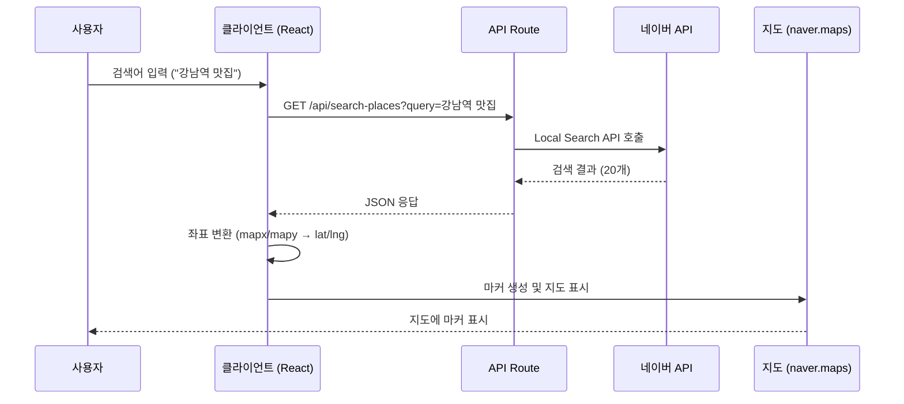

# 네이버 지도 API 연동 가이드

## 문서 정보
- **작성일**: 2025-10-22
- **참고 문서**: `docs/external/위치기반 맛집 리뷰 플랫폼.md`
- **대상 프레임워크**: Next.js 14+ (App Router), TypeScript
- **대상 API**: 네이버 지도 JavaScript API v3, Geocoding API v2, Local Search API v1

---

## 1. 사용할 네이버 API 구분

### 1.1 API 개요

| API 명칭 | 용도 | 호출 위치 | 발급처 |
|---------|------|----------|--------|
| **네이버 지도 JavaScript API v3** | 지도 표시, 마커, 이벤트 처리 | 클라이언트 (브라우저) | NCP 콘솔 |
| **네이버 Geocoding API v2** | 주소 ↔ 좌표 변환 | 서버 (Next.js API Route) | NCP 콘솔 |
| **네이버 Local Search API v1** | 장소 검색 (키워드, 위치 기반) | 서버 (Next.js API Route) | 네이버 개발자 센터 |

### 1.2 왜 3개의 API가 필요한가?

1. **지도 JavaScript API**: 프론트엔드에서 지도를 시각화하고 사용자 인터랙션 처리
2. **Local Search API**: 사용자가 입력한 검색어로 맛집 정보 조회
3. **Geocoding API**: 검색 결과의 주소를 좌표로 변환하거나, 리뷰 작성 시 주소 저장용 (선택적)

---

## 2. API 키 발급 및 설정

### 2.1 네이버 클라우드 플랫폼 (NCP) - 지도 & Geocoding

**발급 절차:**
1. [NCP 콘솔](https://console.naver.com/ncloud/service/maps) 접속 및 로그인
2. **AI·NAVER API** > **Application** 메뉴 이동
3. **Application 등록** 클릭
   - **Maps** 서비스 선택 → Client ID 발급
   - **Map Geocoding** 서비스 선택 → Client ID + Client Secret 발급
4. **서비스 환경** 등록
   - Web Service URL: `http://localhost:3000` (개발), `https://your-domain.com` (프로덕션)

**발급되는 키:**
```
Maps Client ID: abcde12345
Geocoding Client ID: fghij67890
Geocoding Client Secret: klmno12345
```

### 2.2 네이버 개발자 센터 - Local Search

**발급 절차:**
1. [네이버 개발자 센터](https://developers.naver.com) 접속 및 로그인
2. **Application** > **애플리케이션 등록** 클릭
3. **검색** > **지역** API 선택
4. 서비스 URL 등록: `http://localhost:3000`, `https://your-domain.com`

**발급되는 키:**
```
Client ID: pqrst12345
Client Secret: uvwxy67890
```

### 2.3 환경 변수 설정 (.env.local)

```bash
# 네이버 지도 JavaScript API (클라이언트 사이드)
NEXT_PUBLIC_NAVER_MAPS_CLIENT_ID=YOUR_NCP_MAPS_CLIENT_ID

# 네이버 Geocoding API (서버 사이드)
NAVER_GEOCODING_CLIENT_ID=YOUR_NCP_GEOCODING_CLIENT_ID
NAVER_GEOCODING_CLIENT_SECRET=YOUR_NCP_GEOCODING_CLIENT_SECRET

# 네이버 Local Search API (서버 사이드)
NAVER_LOCAL_SEARCH_CLIENT_ID=YOUR_NAVER_DEVELOPER_LOCAL_CLIENT_ID
NAVER_LOCAL_SEARCH_CLIENT_SECRET=YOUR_NAVER_DEVELOPER_LOCAL_CLIENT_SECRET
```

**중요 보안 규칙:**
- `NEXT_PUBLIC_` 접두사: 클라이언트에서 접근 가능 (지도 API만 해당)
- Client Secret: **절대 클라이언트에 노출 금지** (서버 사이드만 사용)
- `.env.local`을 `.gitignore`에 추가

---

## 3. API 호출 방법

### 3.1 네이버 지도 JavaScript API (클라이언트)

**API 주소:**
```
https://oapi.map.naver.com/openapi/v3/maps.js?ncpClientId={CLIENT_ID}&submodules=geocoder
```

**Next.js 구현 예시:**

```tsx
// src/app/page.tsx 또는 지도 컴포넌트
'use client';

import Script from 'next/script';
import { useRef, useState, useEffect } from 'react';

// TypeScript 전역 타입 선언 (필수!)
declare global {
  interface Window {
    naver: any;
  }
}

export default function MapPage() {
  const mapRef = useRef<HTMLDivElement>(null);
  const [mapLoaded, setMapLoaded] = useState(false);
  const [map, setMap] = useState<any>(null);

  const handleScriptLoad = () => {
    setMapLoaded(true);
  };

  useEffect(() => {
    if (!mapLoaded || !mapRef.current || map) return;

    // 지도 초기화
    const mapInstance = new window.naver.maps.Map(mapRef.current, {
      center: new window.naver.maps.LatLng(37.5665, 126.9780), // 서울시청
      zoom: 15,
      zoomControl: true,
      zoomControlOptions: {
        position: window.naver.maps.Position.RIGHT_CENTER,
      },
    });

    setMap(mapInstance);

    // GPS 위치 가져오기
    if (navigator.geolocation) {
      navigator.geolocation.getCurrentPosition(
        (position) => {
          const userLatLng = new window.naver.maps.LatLng(
            position.coords.latitude,
            position.coords.longitude
          );
          mapInstance.setCenter(userLatLng);

          // 현재 위치 마커
          new window.naver.maps.Marker({
            position: userLatLng,
            map: mapInstance,
            title: '내 위치',
          });
        },
        (error) => {
          console.error('Geolocation error:', error);
        }
      );
    }
  }, [mapLoaded, map]);

  return (
    <>
      {/* 스크립트 로드 (beforeInteractive 전략) */}
      <Script
        strategy="beforeInteractive"
        src={`https://oapi.map.naver.com/openapi/v3/maps.js?ncpClientId=${process.env.NEXT_PUBLIC_NAVER_MAPS_CLIENT_ID}&submodules=geocoder`}
        onLoad={handleScriptLoad}
      />

      {/* 지도 컨테이너 */}
      <div ref={mapRef} style={{ width: '100%', height: '500px' }} />
    </>
  );
}
```

**핵심 포인트:**
- `strategy="beforeInteractive"`: 페이지 인터랙션 전에 스크립트 로드
- `submodules=geocoder`: Geocoding 서브모듈 포함 (선택적)
- `declare global`: TypeScript 전역 타입 선언 필수

---

### 3.2 네이버 Local Search API (서버)

**API 주소:**
```
https://openapi.naver.com/v1/search/local.json
```

**Next.js API Route 구현:**

```typescript
// src/app/api/search-places/route.ts
import { NextResponse } from 'next/server';

export async function GET(request: Request) {
  const { searchParams } = new URL(request.url);
  const query = searchParams.get('query');
  const lat = searchParams.get('lat');
  const lng = searchParams.get('lng');
  const radius = searchParams.get('radius') || '5000';

  if (!query) {
    return NextResponse.json(
      { error: 'Query parameter is required.' },
      { status: 400 }
    );
  }

  try {
    const params = new URLSearchParams({
      query,
      display: '20',
      sort: 'random',
    });

    // 위치 기반 검색 (선택적)
    if (lat && lng) {
      params.append('x', lng); // 경도
      params.append('y', lat); // 위도
      params.append('radius', radius);
    }

    const response = await fetch(
      `https://openapi.naver.com/v1/search/local.json?${params}`,
      {
        headers: {
          'X-Naver-Client-Id': process.env.NAVER_LOCAL_SEARCH_CLIENT_ID!,
          'X-Naver-Client-Secret': process.env.NAVER_LOCAL_SEARCH_CLIENT_SECRET!,
        },
      }
    );

    if (!response.ok) {
      throw new Error('Local Search API failed');
    }

    const data = await response.json();
    return NextResponse.json(data.items);
  } catch (error) {
    console.error('Local Search API error:', error);
    return NextResponse.json(
      { error: 'Failed to fetch search results.' },
      { status: 500 }
    );
  }
}
```

**응답 예시:**
```json
[
  {
    "title": "강남 <b>소고기집</b>",
    "link": "http://...",
    "category": "음식점>한식>소고기구이",
    "description": "",
    "telephone": "02-1234-5678",
    "address": "서울특별시 강남구...",
    "roadAddress": "서울특별시 강남구...",
    "mapx": "1269780",  // 경도 (x) * 10^7
    "mapy": "375665"    // 위도 (y) * 10^7
  }
]
```

**좌표 변환 주의:**
```typescript
const lat = parseInt(item.mapy) / 10_000_000;
const lng = parseInt(item.mapx) / 10_000_000;
```

---

### 3.3 네이버 Geocoding API (서버, 선택적)

**API 주소:**
```
https://naveropenapi.apigw.ntruss.com/map-geocode/v2/geocode
```

**Next.js API Route 구현:**

```typescript
// src/app/api/geocode/route.ts
import { NextResponse } from 'next/server';

export async function GET(request: Request) {
  const { searchParams } = new URL(request.url);
  const address = searchParams.get('address');

  if (!address) {
    return NextResponse.json(
      { error: 'Address parameter is required.' },
      { status: 400 }
    );
  }

  try {
    const params = new URLSearchParams({ query: address });

    const response = await fetch(
      `https://naveropenapi.apigw.ntruss.com/map-geocode/v2/geocode?${params}`,
      {
        headers: {
          'X-NCP-APIGW-API-KEY-ID': process.env.NAVER_GEOCODING_CLIENT_ID!,
          'X-NCP-APIGW-API-KEY': process.env.NAVER_GEOCODING_CLIENT_SECRET!,
        },
      }
    );

    if (!response.ok) {
      throw new Error('Geocoding API failed');
    }

    const data = await response.json();

    if (data.addresses?.length > 0) {
      const { x, y } = data.addresses[0]; // x: 경도, y: 위도
      return NextResponse.json({
        lat: parseFloat(y),
        lng: parseFloat(x),
      });
    } else {
      return NextResponse.json(
        { error: 'Address not found.' },
        { status: 404 }
      );
    }
  } catch (error) {
    console.error('Geocoding API error:', error);
    return NextResponse.json(
      { error: 'Failed to fetch geocoding data.' },
      { status: 500 }
    );
  }
}
```

**사용 시나리오:**
- 사용자가 주소를 직접 입력한 경우
- Local Search API 결과에 좌표가 없는 경우

---

## 4. 통합 플로우 예시

### 4.1 장소 검색 → 지도 표시 전체 플로우



### 4.2 코드 예시 (통합)

```tsx
// 클라이언트 컴포넌트
const handleSearch = async (query: string) => {
  // 1. API Route 호출
  const response = await fetch(`/api/search-places?query=${query}`);
  const results = await response.json();

  // 2. 좌표 변환
  const places = results.map((item: any) => ({
    name: item.title.replace(/<\/?b>/g, ''),
    address: item.address,
    category: item.category,
    lat: parseInt(item.mapy) / 10_000_000,
    lng: parseInt(item.mapx) / 10_000_000,
  }));

  // 3. 지도에 마커 표시
  places.forEach((place) => {
    new window.naver.maps.Marker({
      position: new window.naver.maps.LatLng(place.lat, place.lng),
      map: map,
      title: place.name,
    });
  });

  // 4. 지도 범위 조정
  const bounds = new window.naver.maps.LatLngBounds();
  places.forEach((place) => {
    bounds.extend(new window.naver.maps.LatLng(place.lat, place.lng));
  });
  map.fitBounds(bounds);
};
```

---

## 5. 주요 주의사항

### 5.1 보안
- ✅ Client Secret은 **절대** 클라이언트 코드에 노출 금지
- ✅ `.env.local` 파일은 `.gitignore`에 추가
- ✅ 프로덕션 환경에서는 환경 변수를 배포 플랫폼(Vercel 등)에 등록

### 5.2 API 제한
- **Local Search API**: 일일 25,000회 (기본)
- **Geocoding API**: 일일 100,000회 (기본)
- **지도 JavaScript API**: 제한 없음 (웹 서비스 URL 등록 필수)

### 5.3 좌표 형식 주의
```typescript
// Local Search API 응답
mapx: "1269780"  // 경도 * 10^7
mapy: "375665"   // 위도 * 10^7

// 변환 필요
const lat = parseInt(mapy) / 10_000_000; // 37.5665
const lng = parseInt(mapx) / 10_000_000; // 126.9780

// 네이버 지도 사용
new window.naver.maps.LatLng(lat, lng);
```

### 5.4 카테고리 파싱
```typescript
// Local Search API 응답
category: "음식점>한식>소고기구이"

// 파싱
const [depth1, depth2, depth3] = category.split('>');
// depth1: "음식점"
// depth2: "한식"
// depth3: "소고기구이"
```

---

## 6. 체크리스트

### 개발 전 준비
- [ ] NCP 콘솔에서 Maps + Geocoding API 키 발급
- [ ] 네이버 개발자 센터에서 Local Search API 키 발급
- [ ] `.env.local` 파일 생성 및 5개 환경 변수 설정
- [ ] `.gitignore`에 `.env.local` 추가
- [ ] 웹 서비스 URL 등록 (개발: `http://localhost:3000`)

### 구현 체크리스트
- [ ] `declare global { interface Window { naver: any; } }` 타입 선언
- [ ] `<Script strategy="beforeInteractive">` 사용
- [ ] `submodules=geocoder` 파라미터 추가 (필요시)
- [ ] API Route에서 올바른 헤더 형식 사용
- [ ] 좌표 변환 로직 구현 (mapx/mapy → lat/lng)
- [ ] 에러 처리 및 로깅 추가

---

**작성일**: 2025-10-22
**버전**: 1.0
**작성자**: Senior Developer (via Claude Code)
