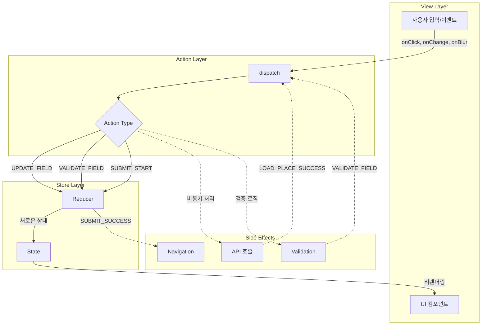
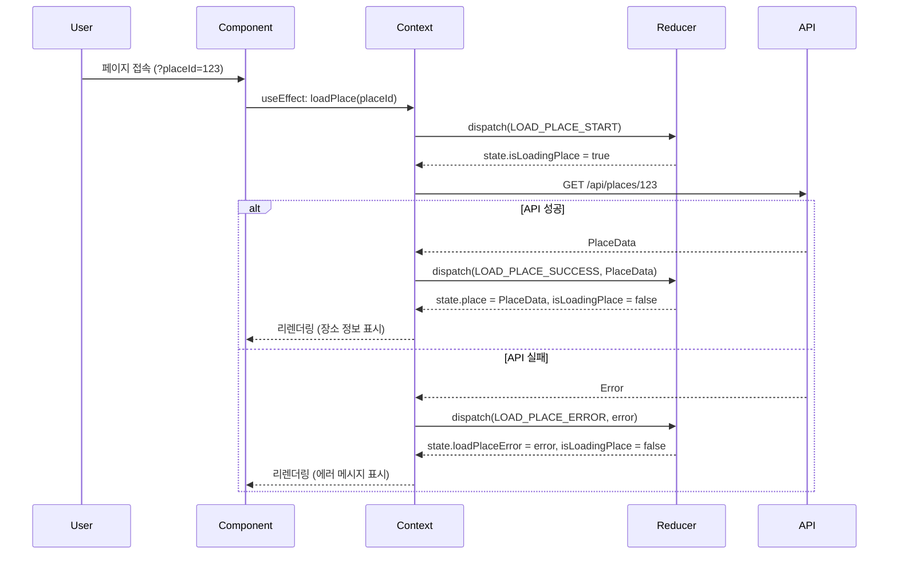
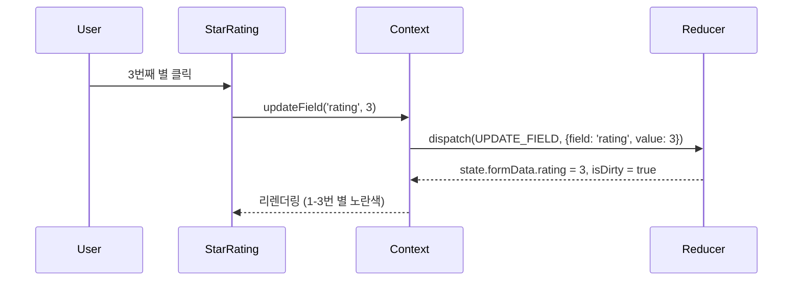
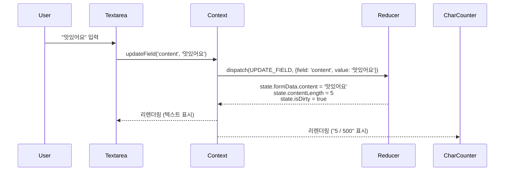
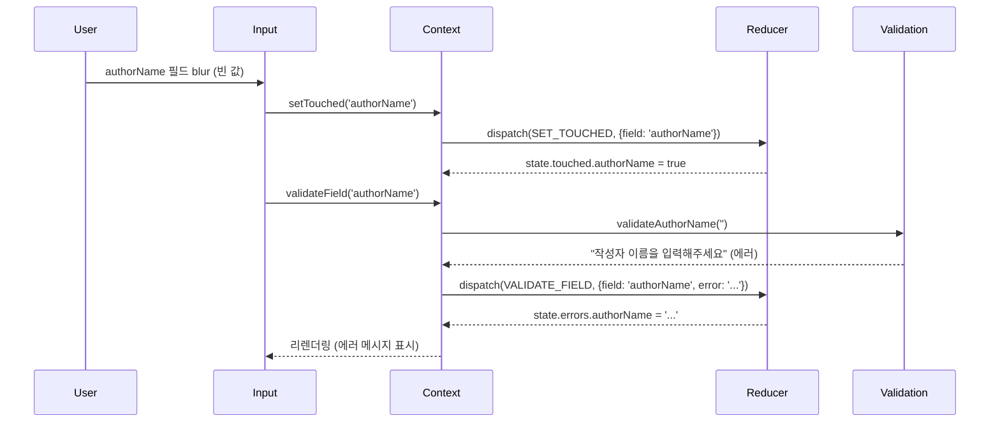
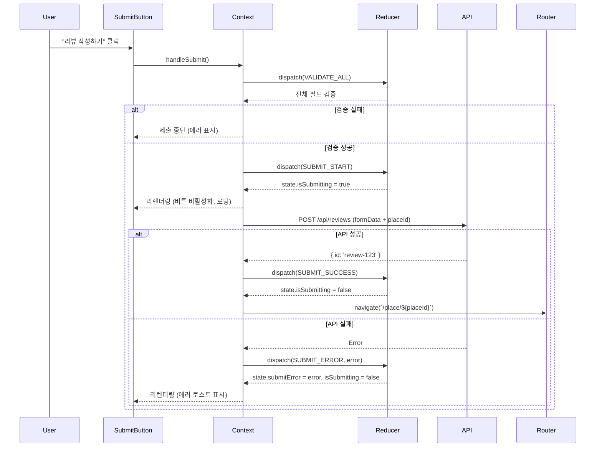
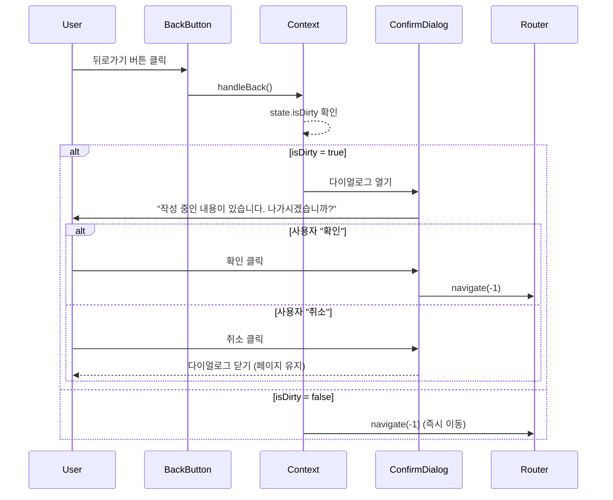

# 리뷰 작성 페이지 상태 관리 설계

## 문서 정보
- **페이지**: 리뷰 작성 페이지 (`/review/new?placeId={id}`)
- **상태 관리 패턴**: Context API + useReducer
- **작성일**: 2025-10-22
- **버전**: 1.0

---

## 1. 개요

### 1.1 목적
리뷰 작성 페이지의 복잡한 폼 상태를 중앙화하여 관리하고, 여러 컴포넌트 간 상태 공유를 용이하게 합니다.

### 1.2 설계 원칙
- **단일 진실의 원천 (Single Source of Truth)**: 모든 폼 상태를 하나의 Context에서 관리
- **불변성 (Immutability)**: Reducer를 통한 상태 업데이트로 예측 가능한 상태 변경
- **관심사 분리 (Separation of Concerns)**: 상태 로직과 UI 로직 분리
- **DRY 원칙**: 중복 로직 최소화

### 1.3 주요 기능
- 장소 정보 로드 및 관리
- 리뷰 폼 데이터 관리 (작성자, 별점, 내용, 비밀번호)
- 실시간 글자 수 카운팅
- 폼 검증 및 에러 처리
- 제출 상태 관리
- 뒤로가기 확인 (변경사항 있을 때)

---

## 2. 상태 데이터 분류

### 2.1 관리해야 할 상태 데이터

#### A. 장소 데이터 (Place Data)
**설명**: 리뷰를 작성할 장소 정보 (읽기 전용)

| 필드명 | 타입 | 필수 | 설명 |
|--------|------|------|------|
| `placeId` | `string` | ✅ | 장소 UUID |
| `placeName` | `string` | ✅ | 식당명 |
| `placeAddress` | `string` | ✅ | 주소 |
| `categoryMain` | `string` | ✅ | 대분류 카테고리 |
| `categorySub` | `string \| null` | - | 소분류 카테고리 |

**초기값**: `null` (로딩 전)
**변경 시점**: API 응답 수신 시
**변경 주체**: `LOAD_PLACE_SUCCESS` action

#### B. 폼 데이터 (Form Data)
**설명**: 사용자가 입력하는 리뷰 정보

| 필드명 | 타입 | 필수 | 제약 조건 |
|--------|------|------|-----------|
| `authorName` | `string` | ✅ | 2-100자 |
| `authorEmail` | `string` | - | 이메일 형식 (선택) |
| `rating` | `number` | ✅ | 1-5 정수 |
| `content` | `string` | ✅ | 1-500자 |
| `password` | `string` | ✅ | 최소 4자 |

**초기값**:
```typescript
{
  authorName: '',
  authorEmail: '',
  rating: 0, // 0 = 미선택
  content: '',
  password: '',
}
```

**변경 시점**: 사용자 입력 시
**변경 주체**: `UPDATE_FIELD` action

#### C. 검증 상태 (Validation State)
**설명**: 각 필드의 검증 결과 및 에러 메시지

| 필드명 | 타입 | 설명 |
|--------|------|------|
| `errors` | `Record<FieldName, string \| null>` | 필드별 에러 메시지 |
| `touched` | `Record<FieldName, boolean>` | 필드별 터치 여부 |

**초기값**:
```typescript
{
  errors: {
    authorName: null,
    authorEmail: null,
    rating: null,
    content: null,
    password: null,
  },
  touched: {
    authorName: false,
    authorEmail: false,
    rating: false,
    content: false,
    password: false,
  },
}
```

**변경 시점**:
- 필드 blur 시 (`SET_TOUCHED`)
- 폼 검증 실행 시 (`VALIDATE_FIELD`)

#### D. UI 상태 (UI State)
**설명**: 페이지 동작과 관련된 UI 상태

| 필드명 | 타입 | 초기값 | 설명 |
|--------|------|--------|------|
| `isLoadingPlace` | `boolean` | `true` | 장소 정보 로딩 중 |
| `isSubmitting` | `boolean` | `false` | 리뷰 제출 중 |
| `isDirty` | `boolean` | `false` | 폼 수정 여부 (뒤로가기 확인용) |
| `contentLength` | `number` | `0` | 현재 리뷰 내용 글자 수 |

**변경 시점**:
- `isLoadingPlace`: API 호출 시작/종료
- `isSubmitting`: 제출 시작/종료
- `isDirty`: 첫 번째 필드 변경 시
- `contentLength`: `content` 필드 변경 시 자동 계산

#### E. 에러 상태 (Error State)
**설명**: 전역 에러 (API 에러, 제출 실패 등)

| 필드명 | 타입 | 초기값 | 설명 |
|--------|------|--------|------|
| `loadPlaceError` | `string \| null` | `null` | 장소 로드 에러 메시지 |
| `submitError` | `string \| null` | `null` | 리뷰 제출 에러 메시지 |

**변경 시점**: API 에러 발생 시

---

### 2.2 화면에 보이지만 상태가 아닌 데이터 (Derived Data)

다음은 기존 상태로부터 계산되는 값으로, 별도 상태로 관리하지 않습니다:

| 데이터 | 계산 방법 | 설명 |
|--------|-----------|------|
| **카테고리 전체 문자열** | `formatCategory(categoryMain, categorySub)` | "한식 > 소고기구이" 형식 |
| **글자 수 색상** | `getCharCountColor(contentLength)` | 0-450: 회색, 451-490: 주황, 491-500: 빨강 |
| **별 아이콘 상태** | `rating` 값 기반 | 1-5: 노란색 채움, 나머지: 회색 빈 별 |
| **제출 버튼 비활성화** | `!isFormValid()` | 필수 필드 미입력 또는 에러 존재 시 |
| **경고 메시지 표시** | `contentLength > 490` | 글자 수 임계값 도달 시 |
| **뒤로가기 확인 다이얼로그** | `isDirty` | 변경사항 있을 때만 표시 |

**계산 로직 위치**:
- 유틸리티 함수: `src/lib/utils/category.ts`, `src/lib/utils/rating.ts`
- 컴포넌트 내부: `useMemo` 훅 사용

---

## 3. 상태 변경 조건 및 화면 변화

| 상태 필드 | 변경 조건 | 변경 후 화면 변화 | Action |
|-----------|-----------|-------------------|--------|
| **placeId** | URL 쿼리 파라미터 파싱 | 없음 (내부 사용) | `INIT_STATE` |
| **장소 정보** | API 응답 성공 | 장소 정보 섹션 렌더링 | `LOAD_PLACE_SUCCESS` |
| **loadPlaceError** | API 응답 실패 | 에러 메시지 표시, 이전 화면 복귀 버튼 | `LOAD_PLACE_ERROR` |
| **authorName** | 사용자 입력 (input change) | 입력 필드 값 업데이트 | `UPDATE_FIELD` |
| **authorEmail** | 사용자 입력 (input change) | 입력 필드 값 업데이트 | `UPDATE_FIELD` |
| **rating** | 별 아이콘 클릭 | 선택된 별까지 노란색 채움, 이후 회색 | `UPDATE_FIELD` |
| **content** | 사용자 입력 (textarea change) | 텍스트 업데이트, 글자 수 카운터 증가 | `UPDATE_FIELD` |
| **contentLength** | `content` 변경 시 자동 계산 | 글자 수 카운터 표시 변경, 색상 변경 (490자 이상 빨강) | `UPDATE_FIELD` (자동) |
| **password** | 사용자 입력 (input change) | 입력 필드 값 업데이트 (마스킹) | `UPDATE_FIELD` |
| **errors[field]** | 필드 blur 또는 제출 시 검증 | 필드 하단에 에러 메시지 표시 | `VALIDATE_FIELD` |
| **touched[field]** | 필드 blur | 에러 메시지 표시 시작 (touched = true일 때만) | `SET_TOUCHED` |
| **isDirty** | 첫 번째 필드 변경 | 뒤로가기 시 확인 다이얼로그 활성화 | `UPDATE_FIELD` (자동) |
| **isSubmitting** | "리뷰 작성하기" 버튼 클릭 | 제출 버튼 비활성화, 로딩 스피너 표시 | `SUBMIT_START` |
| **submitError** | 제출 API 에러 | 에러 토스트 메시지 표시 | `SUBMIT_ERROR` |
| **isSubmitting = false** | 제출 완료 (성공/실패) | 제출 버튼 재활성화, 성공 시 리다이렉트 | `SUBMIT_SUCCESS` |

---

## 4. Reducer Actions 정의

### 4.1 Action Types

```typescript
type ReviewWriteAction =
  | { type: 'INIT_STATE'; payload: { placeId: string } }
  | { type: 'LOAD_PLACE_START' }
  | { type: 'LOAD_PLACE_SUCCESS'; payload: PlaceData }
  | { type: 'LOAD_PLACE_ERROR'; payload: { error: string } }
  | { type: 'UPDATE_FIELD'; payload: { field: FieldName; value: string | number } }
  | { type: 'SET_TOUCHED'; payload: { field: FieldName } }
  | { type: 'VALIDATE_FIELD'; payload: { field: FieldName; error: string | null } }
  | { type: 'VALIDATE_ALL' }
  | { type: 'SUBMIT_START' }
  | { type: 'SUBMIT_SUCCESS' }
  | { type: 'SUBMIT_ERROR'; payload: { error: string } }
  | { type: 'RESET_FORM' };
```

### 4.2 Action 상세 설명

#### INIT_STATE
**목적**: 페이지 마운트 시 placeId 설정
**Payload**: `{ placeId: string }`
**상태 변경**: `state.placeId = payload.placeId`

#### LOAD_PLACE_START
**목적**: 장소 정보 로딩 시작
**Payload**: 없음
**상태 변경**: `state.isLoadingPlace = true`

#### LOAD_PLACE_SUCCESS
**목적**: 장소 정보 로딩 성공
**Payload**: `PlaceData` (name, address, categoryMain, categorySub)
**상태 변경**:
```typescript
state.isLoadingPlace = false
state.place = payload
state.loadPlaceError = null
```

#### LOAD_PLACE_ERROR
**목적**: 장소 정보 로딩 실패
**Payload**: `{ error: string }`
**상태 변경**:
```typescript
state.isLoadingPlace = false
state.loadPlaceError = payload.error
```

#### UPDATE_FIELD
**목적**: 폼 필드 값 변경
**Payload**: `{ field: FieldName; value: string | number }`
**상태 변경**:
```typescript
state.formData[field] = payload.value
state.isDirty = true
if (field === 'content') {
  state.contentLength = payload.value.length
}
```

#### SET_TOUCHED
**목적**: 필드 터치 상태 설정 (blur 이벤트)
**Payload**: `{ field: FieldName }`
**상태 변경**: `state.touched[field] = true`

#### VALIDATE_FIELD
**목적**: 특정 필드 검증 결과 저장
**Payload**: `{ field: FieldName; error: string | null }`
**상태 변경**: `state.errors[field] = payload.error`

#### VALIDATE_ALL
**목적**: 모든 필드 검증 실행
**Payload**: 없음
**상태 변경**: 모든 필드에 대해 검증 함수 실행 후 `errors` 업데이트

#### SUBMIT_START
**목적**: 리뷰 제출 시작
**Payload**: 없음
**상태 변경**: `state.isSubmitting = true`, `state.submitError = null`

#### SUBMIT_SUCCESS
**목적**: 리뷰 제출 성공
**Payload**: 없음
**상태 변경**: `state.isSubmitting = false`
**부가 효과**: 장소 상세 페이지로 리다이렉트

#### SUBMIT_ERROR
**목적**: 리뷰 제출 실패
**Payload**: `{ error: string }`
**상태 변경**: `state.isSubmitting = false`, `state.submitError = payload.error`

#### RESET_FORM
**목적**: 폼 초기화 (사용 빈도 낮음, 테스트용)
**Payload**: 없음
**상태 변경**: `formData`, `errors`, `touched`, `isDirty` 초기화

---

## 5. State 타입 정의

```typescript
// 장소 데이터
type PlaceData = {
  id: string;
  name: string;
  address: string;
  categoryMain: string;
  categorySub: string | null;
};

// 폼 필드명
type FieldName = 'authorName' | 'authorEmail' | 'rating' | 'content' | 'password';

// 폼 데이터
type FormData = {
  authorName: string;
  authorEmail: string;
  rating: number; // 0 = 미선택, 1-5 = 선택
  content: string;
  password: string;
};

// 검증 상태
type ValidationState = {
  errors: Record<FieldName, string | null>;
  touched: Record<FieldName, boolean>;
};

// 전체 상태
type ReviewWriteState = {
  // 장소 데이터
  placeId: string | null;
  place: PlaceData | null;

  // 폼 데이터
  formData: FormData;

  // 검증 상태
  errors: Record<FieldName, string | null>;
  touched: Record<FieldName, boolean>;

  // UI 상태
  isLoadingPlace: boolean;
  isSubmitting: boolean;
  isDirty: boolean;
  contentLength: number;

  // 에러 상태
  loadPlaceError: string | null;
  submitError: string | null;
};

// 초기 상태
const initialState: ReviewWriteState = {
  placeId: null,
  place: null,

  formData: {
    authorName: '',
    authorEmail: '',
    rating: 0,
    content: '',
    password: '',
  },

  errors: {
    authorName: null,
    authorEmail: null,
    rating: null,
    content: null,
    password: null,
  },

  touched: {
    authorName: false,
    authorEmail: false,
    rating: false,
    content: false,
    password: false,
  },

  isLoadingPlace: false,
  isSubmitting: false,
  isDirty: false,
  contentLength: 0,

  loadPlaceError: null,
  submitError: null,
};
```

---

## 6. Flux 패턴 흐름도

### 6.1 전체 데이터 흐름



### 6.2 주요 시나리오별 흐름

#### 시나리오 1: 페이지 초기 로드



#### 시나리오 2: 사용자 입력 (별점 선택)



#### 시나리오 3: 리뷰 내용 입력 (글자 수 카운팅)



#### 시나리오 4: 필드 검증 (blur)



#### 시나리오 5: 리뷰 제출



#### 시나리오 6: 뒤로가기 (변경사항 있을 때)



---

## 7. Context Provider 설계

### 7.1 Context 구조

```typescript
// Context 타입
type ReviewWriteContextValue = {
  // 상태
  state: ReviewWriteState;

  // 액션 디스패처
  dispatch: React.Dispatch<ReviewWriteAction>;

  // 헬퍼 함수 (비즈니스 로직 캡슐화)
  loadPlace: (placeId: string) => Promise<void>;
  updateField: (field: FieldName, value: string | number) => void;
  setTouched: (field: FieldName) => void;
  validateField: (field: FieldName) => void;
  validateAll: () => boolean; // 전체 검증, 통과 여부 반환
  handleSubmit: () => Promise<void>;
  handleBack: () => void;
  resetForm: () => void;

  // 파생 데이터 (메모이제이션)
  isFormValid: boolean;
  formattedCategory: string;
};

// Context 생성
const ReviewWriteContext = createContext<ReviewWriteContextValue | null>(null);

// Provider 컴포넌트
export const ReviewWriteProvider: React.FC<{ children: React.ReactNode }> = ({ children }) => {
  const [state, dispatch] = useReducer(reviewWriteReducer, initialState);

  // 페이지 마운트 시 placeId 초기화
  useEffect(() => {
    const params = new URLSearchParams(window.location.search);
    const placeId = params.get('placeId');

    if (!placeId) {
      // placeId 없으면 에러 처리 또는 메인 페이지로 리다이렉트
      return;
    }

    dispatch({ type: 'INIT_STATE', payload: { placeId } });
    loadPlace(placeId);
  }, []);

  // 비즈니스 로직 함수들...
  const loadPlace = useCallback(async (placeId: string) => {
    dispatch({ type: 'LOAD_PLACE_START' });

    try {
      const response = await apiClient.get(`/api/places/${placeId}`);
      const placeData = PlaceSchema.parse(response.data);
      dispatch({ type: 'LOAD_PLACE_SUCCESS', payload: placeData });
    } catch (error) {
      const message = extractApiErrorMessage(error, '장소 정보를 불러올 수 없습니다.');
      dispatch({ type: 'LOAD_PLACE_ERROR', payload: { error: message } });
    }
  }, []);

  const updateField = useCallback((field: FieldName, value: string | number) => {
    dispatch({ type: 'UPDATE_FIELD', payload: { field, value } });
  }, []);

  // ... 기타 함수들

  // 파생 데이터 계산
  const isFormValid = useMemo(() => {
    return (
      state.formData.authorName.length >= 2 &&
      state.formData.rating >= 1 &&
      state.formData.rating <= 5 &&
      state.formData.content.length >= 1 &&
      state.formData.content.length <= 500 &&
      state.formData.password.length >= 4 &&
      Object.values(state.errors).every(error => error === null)
    );
  }, [state.formData, state.errors]);

  const formattedCategory = useMemo(() => {
    if (!state.place) return '';
    return formatCategory(state.place.categoryMain, state.place.categorySub);
  }, [state.place]);

  const value: ReviewWriteContextValue = {
    state,
    dispatch,
    loadPlace,
    updateField,
    setTouched,
    validateField,
    validateAll,
    handleSubmit,
    handleBack,
    resetForm,
    isFormValid,
    formattedCategory,
  };

  return (
    <ReviewWriteContext.Provider value={value}>
      {children}
    </ReviewWriteContext.Provider>
  );
};

// 커스텀 훅
export const useReviewWrite = () => {
  const context = useContext(ReviewWriteContext);
  if (!context) {
    throw new Error('useReviewWrite must be used within ReviewWriteProvider');
  }
  return context;
};
```

### 7.2 Reducer 함수

```typescript
function reviewWriteReducer(
  state: ReviewWriteState,
  action: ReviewWriteAction
): ReviewWriteState {
  switch (action.type) {
    case 'INIT_STATE':
      return {
        ...state,
        placeId: action.payload.placeId,
      };

    case 'LOAD_PLACE_START':
      return {
        ...state,
        isLoadingPlace: true,
        loadPlaceError: null,
      };

    case 'LOAD_PLACE_SUCCESS':
      return {
        ...state,
        isLoadingPlace: false,
        place: action.payload,
      };

    case 'LOAD_PLACE_ERROR':
      return {
        ...state,
        isLoadingPlace: false,
        loadPlaceError: action.payload.error,
      };

    case 'UPDATE_FIELD': {
      const { field, value } = action.payload;
      return {
        ...state,
        formData: {
          ...state.formData,
          [field]: value,
        },
        isDirty: true,
        contentLength: field === 'content' ? (value as string).length : state.contentLength,
      };
    }

    case 'SET_TOUCHED':
      return {
        ...state,
        touched: {
          ...state.touched,
          [action.payload.field]: true,
        },
      };

    case 'VALIDATE_FIELD':
      return {
        ...state,
        errors: {
          ...state.errors,
          [action.payload.field]: action.payload.error,
        },
      };

    case 'VALIDATE_ALL': {
      // 모든 필드 검증 로직 실행
      const errors = validateAllFields(state.formData);
      const touched = Object.keys(state.touched).reduce((acc, key) => ({
        ...acc,
        [key]: true,
      }), {} as Record<FieldName, boolean>);

      return {
        ...state,
        errors,
        touched,
      };
    }

    case 'SUBMIT_START':
      return {
        ...state,
        isSubmitting: true,
        submitError: null,
      };

    case 'SUBMIT_SUCCESS':
      return {
        ...state,
        isSubmitting: false,
      };

    case 'SUBMIT_ERROR':
      return {
        ...state,
        isSubmitting: false,
        submitError: action.payload.error,
      };

    case 'RESET_FORM':
      return {
        ...state,
        formData: initialState.formData,
        errors: initialState.errors,
        touched: initialState.touched,
        isDirty: false,
        contentLength: 0,
        submitError: null,
      };

    default:
      return state;
  }
}
```

---

## 8. 검증 로직

### 8.1 필드별 검증 함수

```typescript
// 검증 함수 타입
type Validator = (value: any) => string | null;

// 작성자 이름 검증
const validateAuthorName: Validator = (value: string) => {
  if (!value || value.trim().length === 0) {
    return '작성자 이름을 입력해주세요.';
  }
  if (value.length < 2) {
    return '작성자 이름은 최소 2자 이상이어야 합니다.';
  }
  if (value.length > 100) {
    return '작성자 이름은 최대 100자까지 입력 가능합니다.';
  }
  return null;
};

// 작성자 이메일 검증 (선택 필드)
const validateAuthorEmail: Validator = (value: string) => {
  if (!value || value.trim().length === 0) {
    return null; // 선택 필드이므로 빈 값 허용
  }

  const emailRegex = /^[^\s@]+@[^\s@]+\.[^\s@]+$/;
  if (!emailRegex.test(value)) {
    return '올바른 이메일 형식이 아닙니다.';
  }
  return null;
};

// 평점 검증
const validateRating: Validator = (value: number) => {
  if (value === 0) {
    return '평점을 선택해주세요.';
  }
  if (value < 1 || value > 5) {
    return '평점은 1-5점 사이여야 합니다.';
  }
  return null;
};

// 리뷰 내용 검증
const validateContent: Validator = (value: string) => {
  if (!value || value.trim().length === 0) {
    return '리뷰 내용을 입력해주세요.';
  }
  if (value.length > 500) {
    return '리뷰 내용은 최대 500자까지 입력 가능합니다.';
  }
  return null;
};

// 비밀번호 검증
const validatePassword: Validator = (value: string) => {
  if (!value || value.length === 0) {
    return '비밀번호를 입력해주세요.';
  }
  if (value.length < 4) {
    return '비밀번호는 최소 4자 이상이어야 합니다.';
  }
  return null;
};

// 전체 검증
const validateAllFields = (formData: FormData): Record<FieldName, string | null> => {
  return {
    authorName: validateAuthorName(formData.authorName),
    authorEmail: validateAuthorEmail(formData.authorEmail),
    rating: validateRating(formData.rating),
    content: validateContent(formData.content),
    password: validatePassword(formData.password),
  };
};
```

---

## 9. 하위 컴포넌트에 노출할 API

### 9.1 useReviewWrite 훅 반환값

```typescript
// 컴포넌트에서 사용 예시
const {
  // 읽기 전용 상태
  state,              // 전체 상태 (필요 시 개별 필드 접근)
  isFormValid,        // 폼 검증 통과 여부
  formattedCategory,  // 포맷팅된 카테고리 문자열

  // 액션 함수
  updateField,        // 필드 값 변경
  setTouched,         // 필드 터치 상태 설정
  validateField,      // 특정 필드 검증
  validateAll,        // 전체 검증
  handleSubmit,       // 리뷰 제출
  handleBack,         // 뒤로가기
} = useReviewWrite();
```

### 9.2 컴포넌트별 사용 예시

#### PlaceInfoSection 컴포넌트
```typescript
const { state, formattedCategory } = useReviewWrite();

// 렌더링
if (state.isLoadingPlace) return <PlaceSkeleton />;
if (state.loadPlaceError) return <ErrorMessage error={state.loadPlaceError} />;

return (
  <div>
    <h2>{state.place?.name}</h2>
    <p>{state.place?.address}</p>
    <CategoryBadge category={formattedCategory} />
  </div>
);
```

#### AuthorInput 컴포넌트
```typescript
const { state, updateField, setTouched, validateField } = useReviewWrite();

const handleChange = (e: React.ChangeEvent<HTMLInputElement>) => {
  updateField('authorName', e.target.value);
};

const handleBlur = () => {
  setTouched('authorName');
  validateField('authorName');
};

return (
  <Input
    value={state.formData.authorName}
    onChange={handleChange}
    onBlur={handleBlur}
    error={state.touched.authorName ? state.errors.authorName : null}
  />
);
```

#### StarRating 컴포넌트
```typescript
const { state, updateField } = useReviewWrite();

const handleRatingClick = (rating: number) => {
  updateField('rating', rating);
};

return (
  <RatingStars
    rating={state.formData.rating}
    interactive={true}
    onChange={handleRatingClick}
  />
);
```

#### ReviewTextarea 컴포넌트
```typescript
const { state, updateField, setTouched, validateField } = useReviewWrite();

const handleChange = (e: React.ChangeEvent<HTMLTextAreaElement>) => {
  const value = e.target.value;
  if (value.length <= 500) {
    updateField('content', value);
  }
};

const handleBlur = () => {
  setTouched('content');
  validateField('content');
};

return (
  <div>
    <Textarea
      value={state.formData.content}
      onChange={handleChange}
      onBlur={handleBlur}
      maxLength={500}
      error={state.touched.content ? state.errors.content : null}
    />
    <CharacterCounter
      current={state.contentLength}
      max={500}
      showWarning={state.contentLength > 490}
    />
  </div>
);
```

#### SubmitButton 컴포넌트
```typescript
const { state, isFormValid, handleSubmit } = useReviewWrite();

return (
  <Button
    onClick={handleSubmit}
    disabled={!isFormValid || state.isSubmitting}
    loading={state.isSubmitting}
  >
    {state.isSubmitting ? '제출 중...' : '리뷰 작성하기'}
  </Button>
);
```

#### BackButton 컴포넌트
```typescript
const { handleBack } = useReviewWrite();

return (
  <Button variant="ghost" onClick={handleBack}>
    <ArrowLeft size={20} />
    뒤로가기
  </Button>
);
```

---

## 10. 컴포넌트 구조

```
src/app/review/new/page.tsx (페이지)
└── ReviewWriteProvider (Context Provider)
    └── ReviewWritePageContent
        ├── NavigationBar
        │   └── BackButton (useReviewWrite)
        │
        ├── PlaceInfoSection (useReviewWrite)
        │   ├── PlaceImage
        │   ├── PlaceName
        │   ├── PlaceAddress
        │   └── CategoryBadge
        │
        └── ReviewForm
            ├── AuthorInput (useReviewWrite)
            ├── EmailInput (useReviewWrite)
            ├── StarRating (useReviewWrite)
            ├── ReviewTextarea (useReviewWrite)
            │   └── CharacterCounter
            ├── PasswordInput (useReviewWrite)
            └── SubmitButton (useReviewWrite)
```

**파일 구조**:
```
src/
├── app/
│   └── review/
│       └── new/
│           └── page.tsx                      # 페이지 엔트리
│
├── features/
│   └── review/
│       ├── context/
│       │   └── review-write-context.tsx      # Context + Provider
│       │
│       ├── reducers/
│       │   └── review-write-reducer.ts       # Reducer 함수
│       │
│       ├── validators/
│       │   └── review-validators.ts          # 검증 함수
│       │
│       └── components/
│           ├── place-info-section.tsx
│           ├── author-input.tsx
│           ├── star-rating.tsx
│           ├── review-textarea.tsx
│           ├── password-input.tsx
│           └── submit-button.tsx
```

---

## 11. 구현 가이드라인

### 11.1 DRY 원칙 준수

#### 중복 방지 사례 1: 검증 로직
❌ **잘못된 예 (각 컴포넌트에서 검증)**:
```typescript
// AuthorInput.tsx
const error = value.length < 2 ? '최소 2자 이상' : null;

// PasswordInput.tsx
const error = value.length < 4 ? '최소 4자 이상' : null;
```

✅ **올바른 예 (중앙화된 검증 함수)**:
```typescript
// validators/review-validators.ts
export const validateAuthorName = (value: string) => { /* ... */ };
export const validatePassword = (value: string) => { /* ... */ };

// Context에서 사용
validateField('authorName'); // 내부적으로 validateAuthorName 호출
```

#### 중복 방지 사례 2: 필드 업데이트
❌ **잘못된 예 (각 컴포넌트에서 dispatch)**:
```typescript
// AuthorInput.tsx
dispatch({ type: 'UPDATE_FIELD', payload: { field: 'authorName', value } });

// EmailInput.tsx
dispatch({ type: 'UPDATE_FIELD', payload: { field: 'authorEmail', value } });
```

✅ **올바른 예 (헬퍼 함수 사용)**:
```typescript
// Context에서 제공
updateField('authorName', value);
updateField('authorEmail', value);
```

### 11.2 성능 최적화

1. **메모이제이션**: 파생 데이터는 `useMemo`로 캐싱
2. **콜백 메모이제이션**: 이벤트 핸들러는 `useCallback`으로 안정화
3. **컴포넌트 분리**: 자주 변경되는 상태와 그렇지 않은 상태 분리
4. **조건부 렌더링**: `isLoadingPlace`, `loadPlaceError` 상태로 스켈레톤/에러 UI 분기

### 11.3 타입 안정성

- 모든 상태, 액션, 함수에 TypeScript 타입 명시
- Zod 스키마로 API 응답 검증
- `as` 타입 단언 최소화

### 11.4 접근성

- 모든 input에 `<label>` 태그 연결
- 에러 메시지에 `aria-live="polite"` 적용
- 별점 선택 시 키보드 네비게이션 지원

### 11.5 에러 처리

- API 에러: `loadPlaceError`, `submitError`로 명확히 구분
- 사용자 친화적 에러 메시지 표시
- 재시도 옵션 제공 (장소 로드 실패 시)

---

## 12. 테스트 전략

### 12.1 단위 테스트

- **Reducer 테스트**: 각 액션별 상태 변경 검증
- **Validator 테스트**: 각 검증 함수의 경계값 테스트
- **헬퍼 함수 테스트**: `updateField`, `validateField` 등

### 12.2 통합 테스트

- **Context Provider 테스트**: Provider 내부 로직 검증
- **컴포넌트 테스트**: useReviewWrite 훅 사용 컴포넌트 테스트

### 12.3 E2E 테스트

- 리뷰 작성 전체 플로우
- 뒤로가기 확인 다이얼로그
- 에러 시나리오 (장소 로드 실패, 제출 실패)

---

## 13. 마이그레이션 가이드 (React Hook Form 대신 Context 사용)

기존에 React Hook Form 사용을 고려했다면, Context + useReducer 방식의 장점:

### 장점
- ✅ 전체 상태 흐름 가시성 향상
- ✅ 복잡한 비즈니스 로직 중앙 관리
- ✅ 디버깅 용이 (Redux DevTools 사용 가능)
- ✅ 글자 수 카운팅 등 커스텀 상태 통합 관리

### 단점
- ❌ 초기 설정 코드량 증가
- ❌ 폼 검증 라이브러리 기능 직접 구현 필요

### 선택 기준
- **Context + useReducer**: 복잡한 상태 로직, 다중 컴포넌트 간 상태 공유
- **React Hook Form**: 단순한 폼, 빠른 구현 필요 시

---

## 14. 결론

본 설계는 리뷰 작성 페이지의 모든 상태를 체계적으로 관리하며, Flux 패턴의 단방향 데이터 흐름을 준수합니다. Context API와 useReducer를 활용하여 상태 로직을 중앙화하고, DRY 원칙을 철저히 준수하여 유지보수성을 극대화했습니다.

**다음 단계**: 본 설계를 기반으로 실제 구현 진행

---

**작성일**: 2025-10-22
**작성자**: Senior Developer
**검토자**: (TBD)
