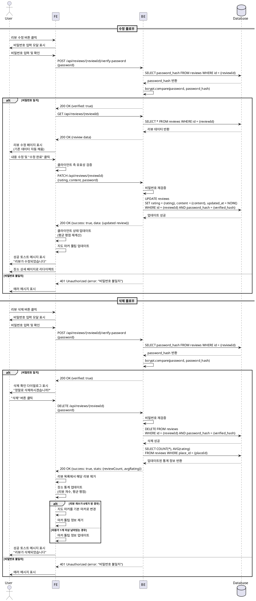

# UseCase 11: 리뷰 수정/삭제 (향후 기능)

## Primary Actor
- 리뷰 작성자 (Contributor)

## Precondition
- 사용자가 이전에 리뷰를 작성한 상태
- 장소 상세 페이지 또는 리뷰 목록에서 자신이 작성한 리뷰를 확인할 수 있는 상태
- 리뷰 작성 시 설정한 비밀번호를 기억하고 있음

## Trigger
- 사용자가 리뷰 카드의 수정 또는 삭제 버튼을 클릭

## Main Scenario

### 1. 수정/삭제 버튼 노출
1. 사용자가 장소 상세 페이지에서 리뷰 목록을 조회
2. 각 리뷰 카드에 수정/삭제 버튼이 항상 표시됨 (모든 리뷰에 공통)
3. 사용자가 자신이 작성한 리뷰의 수정 또는 삭제 버튼을 클릭

### 2. 비밀번호 검증 모달 표시
1. 시스템이 비밀번호 입력 모달을 표시
2. 모달 구성요소:
   - 제목: "비밀번호 확인"
   - 안내 메시지: "리뷰 작성 시 설정한 비밀번호를 입력해주세요"
   - 비밀번호 입력 필드 (type: password)
   - 확인 버튼
   - 취소 버튼
3. 사용자가 비밀번호를 입력하고 확인 버튼 클릭

### 3. 비밀번호 검증 처리
1. FE가 입력된 비밀번호와 리뷰 ID를 BE로 전송
2. BE가 리뷰 ID로 해당 리뷰의 password_hash 조회
3. BE가 입력된 비밀번호를 해싱하여 저장된 해시와 비교
4. 검증 결과에 따라 분기:
   - 성공: 수정/삭제 권한 부여
   - 실패: 에러 메시지 표시

## Main Scenario (수정 플로우)

### 4-A. 리뷰 수정 진입
1. 비밀번호 검증 성공 후 리뷰 수정 페이지로 이동
2. 시스템이 기존 리뷰 데이터를 조회하여 폼에 자동 채움:
   - 작성자명 (읽기 전용)
   - 기존 평점 (별점 선택 UI에 반영)
   - 기존 리뷰 내용 (textarea에 표시)
   - 비밀번호 필드 (빈 값, 선택적 변경)
3. 사용자가 수정할 내용을 변경
4. "수정 완료" 버튼 클릭

### 5-A. 리뷰 수정 제출
1. FE가 수정된 데이터 유효성 검증
   - 평점: 필수, 1-5 범위
   - 리뷰 내용: 필수, 1-500자
   - 비밀번호: 선택적 (변경 시에만 입력)
2. FE가 BE로 수정 요청 전송 (PATCH /api/reviews/{reviewId})
   - 수정할 필드: rating, content
   - 비밀번호 (재검증용)
   - 새 비밀번호 (변경 시)
3. BE가 비밀번호 재검증 후 DB 업데이트
4. DB가 reviews 테이블의 해당 레코드 업데이트
   - rating, content 수정
   - updated_at 자동 갱신 (트리거)
   - password_hash 업데이트 (새 비밀번호 입력 시)
5. BE가 FE에게 수정 성공 응답 반환

### 6-A. 수정 완료 후 처리
1. FE가 성공 토스트 메시지 표시: "리뷰가 수정되었습니다"
2. FE가 장소 상세 페이지로 자동 리다이렉트
3. 리뷰 목록에서 수정된 리뷰가 업데이트되어 표시
   - 수정된 평점 및 내용 반영
   - 작성일은 유지, updated_at 표시 추가 가능 (옵션)
4. 장소의 평균 평점 재계산 및 업데이트
5. 지도 마커의 툴팁 정보 업데이트 (평균 평점 변경 반영)

## Main Scenario (삭제 플로우)

### 4-B. 리뷰 삭제 확인
1. 비밀번호 검증 성공 후 삭제 확인 다이얼로그 표시
2. 확인 다이얼로그 구성요소:
   - 제목: "리뷰 삭제"
   - 메시지: "정말로 이 리뷰를 삭제하시겠습니까? 삭제된 리뷰는 복구할 수 없습니다."
   - 삭제 버튼 (빨간색 강조)
   - 취소 버튼
3. 사용자가 삭제 버튼 클릭

### 5-B. 리뷰 삭제 처리
1. FE가 BE로 삭제 요청 전송 (DELETE /api/reviews/{reviewId})
   - 비밀번호 (재검증용)
2. BE가 비밀번호 재검증
3. BE가 DB에서 해당 리뷰 삭제
   - DELETE FROM reviews WHERE id = {reviewId} AND password_hash = {verified_hash}
   - ON DELETE CASCADE로 연관 데이터 자동 처리 (향후 사진 등)
4. BE가 FE에게 삭제 성공 응답 반환

### 6-B. 삭제 완료 후 처리
1. FE가 성공 토스트 메시지 표시: "리뷰가 삭제되었습니다"
2. FE가 리뷰 목록에서 해당 리뷰 제거 (UI 업데이트)
3. FE가 장소의 리뷰 통계 업데이트:
   - 총 리뷰 개수 감소
   - 평균 평점 재계산
4. 해당 장소의 리뷰 개수가 0개가 된 경우:
   - 지도 마커를 리뷰 존재 마커 → 기본 마커로 변경
   - 마커 툴팁에서 리뷰 정보 제거
5. 리뷰가 1개 이상 남아있는 경우:
   - 지도 마커 툴팁 정보 업데이트 (평균 평점, 리뷰 개수)

## Edge Cases

### EC-1: 비밀번호 불일치
- **상황**: 사용자가 잘못된 비밀번호를 입력
- **처리**:
  - 에러 메시지 표시: "비밀번호가 일치하지 않습니다"
  - 비밀번호 입력 필드 초기화
  - 재시도 횟수 제한 (3회) 후 일정 시간 대기 (스팸 방지)
  - 3회 실패 시: "비밀번호를 3회 잘못 입력하셨습니다. 잠시 후 다시 시도해주세요" (5분 대기)

### EC-2: 비밀번호 분실
- **상황**: 사용자가 리뷰 작성 시 설정한 비밀번호를 잊어버림
- **처리**:
  - 비밀번호 입력 모달에 안내 메시지 추가:
    "비밀번호를 잊으셨나요? 현재 비밀번호 복구 기능은 제공되지 않습니다."
  - 향후 개선: 이메일 입력 시 이메일 인증을 통한 복구 기능 고려

### EC-3: 네트워크 오류 (수정/삭제 중)
- **상황**: 수정 또는 삭제 요청 중 네트워크 오류 발생
- **처리**:
  - 로딩 인디케이터 표시 중단
  - 에러 메시지 표시: "네트워크 오류가 발생했습니다. 다시 시도해주세요"
  - 재시도 버튼 제공
  - 수정 중이던 내용 유지 (로컬 상태 보존)

### EC-4: 이미 삭제된 리뷰 접근
- **상황**: 다른 탭에서 삭제한 리뷰를 현재 탭에서 수정/삭제 시도
- **처리**:
  - BE가 404 Not Found 응답 반환
  - FE가 에러 메시지 표시: "이미 삭제된 리뷰입니다"
  - 자동으로 리뷰 목록 새로고침

### EC-5: 동시 수정 충돌
- **상황**: 여러 탭에서 동일 리뷰를 동시에 수정
- **처리**:
  - 낙관적 잠금(Optimistic Locking) 적용
  - updated_at 필드를 버전 체크에 활용
  - 충돌 감지 시 에러 메시지: "다른 곳에서 수정된 리뷰입니다. 페이지를 새로고침해주세요"

### EC-6: 수정 중 브라우저 새로고침
- **상황**: 리뷰 수정 페이지에서 작성 중 브라우저 새로고침
- **처리**:
  - beforeunload 이벤트 감지 및 확인 다이얼로그 표시
  - "작성 중인 내용이 있습니다. 페이지를 나가시겠습니까?"
  - 확인 시: 작성 내용 폐기 및 페이지 리로드
  - 취소 시: 페이지 유지

### EC-7: 유효하지 않은 리뷰 ID
- **상황**: URL 조작 등으로 존재하지 않는 리뷰 ID 접근
- **처리**:
  - BE가 404 Not Found 응답 반환
  - FE가 에러 페이지 표시 또는 장소 상세 페이지로 리다이렉트

### EC-8: 수정 시 필수 필드 누락
- **상황**: 수정 폼에서 평점 또는 내용 삭제 후 제출 시도
- **처리**:
  - FE가 클라이언트 측 유효성 검증 수행
  - 누락된 필드에 에러 메시지 표시
  - 제출 버튼 비활성화 (모든 필드 채워질 때까지)

### EC-9: 마지막 리뷰 삭제 시 마커 업데이트 실패
- **상황**: 마지막 리뷰 삭제 후 지도 마커 업데이트 중 오류 발생
- **처리**:
  - 에러 로깅 (콘솔 또는 모니터링 서비스)
  - 사용자에게는 삭제 성공 메시지 표시 (리뷰 삭제는 완료됨)
  - 페이지 새로고침 시 정상 반영

### EC-10: Rate Limiting (악의적 수정/삭제 반복)
- **상황**: 동일 사용자가 짧은 시간 내 반복적으로 수정/삭제 시도
- **처리**:
  - IP 기반 Rate Limiting 적용 (1분에 5회 제한)
  - 제한 초과 시: "잠시 후 다시 시도해주세요" 메시지 표시
  - 일정 시간 대기 후 재시도 가능

## Business Rules

### BR-1: 비밀번호 기반 인증
- 리뷰 수정/삭제는 리뷰 작성 시 설정한 비밀번호로만 가능
- 비밀번호는 bcrypt 해싱되어 DB에 저장
- 비밀번호 검증은 서버 측에서만 수행

### BR-2: 수정 가능 필드
- 수정 가능: 평점(rating), 리뷰 내용(content), 비밀번호(password)
- 수정 불가: 작성자명(author_name), 작성일(created_at), 장소 정보(place_id)

### BR-3: 삭제 정책
- Hard Delete 방식 (DB에서 레코드 완전 삭제)
- 삭제된 리뷰는 복구 불가
- 향후 Soft Delete 전환 고려 (deleted_at 필드 추가)

### BR-4: 평균 평점 재계산
- 리뷰 수정/삭제 시 해당 장소의 평균 평점 자동 재계산
- 계산 방식: AVG(rating) FROM reviews WHERE place_id = {placeId}
- 리뷰 개수가 0개가 되면 평균 평점도 0 또는 null로 설정

### BR-5: 마커 상태 업데이트
- 마지막 리뷰 삭제 시 지도 마커를 기본 마커로 자동 변경
- 리뷰 평점 수정 시 마커 툴팁의 평균 평점 업데이트
- 마커 업데이트는 클라이언트 측에서 즉시 반영

### BR-6: 작성일/수정일 관리
- created_at: 최초 작성 시각 유지 (수정 불가)
- updated_at: 리뷰 수정 시 자동 갱신 (DB 트리거)
- UI에 "수정됨" 표시 추가 고려 (created_at ≠ updated_at인 경우)

### BR-7: 중복 제출 방지
- 수정/삭제 버튼 클릭 후 로딩 중 버튼 비활성화
- 요청 완료 또는 에러 발생 시에만 재활성화
- 동시에 여러 요청 전송 방지

## Sequence Diagram



## Data Requirements

### Input Data (수정)
| 데이터 항목 | 데이터 타입 | 필수 여부 | 설명 |
|------------|------------|----------|------|
| reviewId | UUID | 필수 | 수정할 리뷰의 고유 식별자 |
| password | String | 필수 | 리뷰 작성 시 설정한 비밀번호 (검증용) |
| rating | Integer | 필수 | 수정할 평점 (1-5) |
| content | String | 필수 | 수정할 리뷰 내용 (1-500자) |
| newPassword | String | 선택 | 새로운 비밀번호 (변경 시에만) |

### Input Data (삭제)
| 데이터 항목 | 데이터 타입 | 필수 여부 | 설명 |
|------------|------------|----------|------|
| reviewId | UUID | 필수 | 삭제할 리뷰의 고유 식별자 |
| password | String | 필수 | 리뷰 작성 시 설정한 비밀번호 (검증용) |

### Output Data (수정 성공)
| 데이터 항목 | 데이터 타입 | 설명 |
|------------|------------|------|
| success | Boolean | 수정 성공 여부 |
| data.reviewId | UUID | 수정된 리뷰 ID |
| data.rating | Integer | 수정된 평점 |
| data.content | String | 수정된 리뷰 내용 |
| data.updatedAt | ISO 8601 Timestamp | 수정일시 |

### Output Data (삭제 성공)
| 데이터 항목 | 데이터 타입 | 설명 |
|------------|------------|------|
| success | Boolean | 삭제 성공 여부 |
| data.reviewId | UUID | 삭제된 리뷰 ID |
| data.placeStats.reviewCount | Integer | 삭제 후 남은 리뷰 개수 |
| data.placeStats.avgRating | Decimal | 삭제 후 평균 평점 |

### Database Query (수정)
```sql
-- 비밀번호 검증
SELECT id, password_hash
FROM reviews
WHERE id = {reviewId};

-- 리뷰 수정
UPDATE reviews
SET
  rating = {rating},
  content = {content},
  password_hash = {new_password_hash}, -- 새 비밀번호 입력 시에만
  updated_at = NOW()
WHERE id = {reviewId} AND password_hash = crypt({password}, password_hash)
RETURNING id, rating, content, updated_at;
```

### Database Query (삭제)
```sql
-- 비밀번호 검증 및 삭제
DELETE FROM reviews
WHERE id = {reviewId} AND password_hash = crypt({password}, password_hash)
RETURNING id, place_id;

-- 삭제 후 통계 조회
SELECT
  COUNT(*) as review_count,
  COALESCE(AVG(rating), 0) as avg_rating
FROM reviews
WHERE place_id = {placeId};
```

## UI/UX Specifications

### 1. 리뷰 카드에 수정/삭제 버튼 추가
```
┌─────────────────────────────────────┐
│  ⭐⭐⭐⭐⭐ (5.0)                    │
│  작성자: 파스타러버                  │
│  작성일: 2025-10-20                 │
│                                     │
│  "크림 파스타가 정말 맛있었어요..."  │
│                                     │
│  [수정] [삭제]                ← 버튼│
└─────────────────────────────────────┘
```

### 2. 비밀번호 입력 모달
```
┌─────────────────────────────────────┐
│  비밀번호 확인                 [X]   │
├─────────────────────────────────────┤
│                                     │
│  리뷰 작성 시 설정한 비밀번호를      │
│  입력해주세요                        │
│                                     │
│  비밀번호:                          │
│  [••••••••••••]                     │
│                                     │
│  비밀번호를 잊으셨나요?              │
│  현재 비밀번호 복구 기능은           │
│  제공되지 않습니다.                  │
│                                     │
│  [취소]            [확인]           │
└─────────────────────────────────────┘
```

### 3. 리뷰 수정 페이지
```
┌─────────────────────────────────────┐
│  ← 뒤로가기          리뷰 수정      │
├─────────────────────────────────────┤
│  [대표 사진 썸네일]                  │
│  강남 소고기집                       │
│  서울시 강남구 역삼동 123-45         │
│  한식 > 소고기 구이                  │
├─────────────────────────────────────┤
│  작성자: 파스타러버 (변경 불가)      │
│                                     │
│  평점                                │
│  ⭐⭐⭐⭐⭐                        │
│                                     │
│  리뷰 내용                           │
│  ┌───────────────────────────────┐ │
│  │크림 파스타가 정말 맛있었어요.   │ │
│  │면도 쫄깃하고 소스도 진해서...   │ │
│  └───────────────────────────────┘ │
│  485 / 500                          │
│                                     │
│  비밀번호 변경 (선택)                │
│  [_________________]                │
│  * 비밀번호를 변경하려면 입력하세요  │
│                                     │
│  [     수정 완료     ]              │
└─────────────────────────────────────┘
```

### 4. 삭제 확인 다이얼로그
```
┌─────────────────────────────────────┐
│  ⚠️ 리뷰 삭제                        │
├─────────────────────────────────────┤
│                                     │
│  정말로 이 리뷰를 삭제하시겠습니까?  │
│  삭제된 리뷰는 복구할 수 없습니다.   │
│                                     │
│  [취소]            [삭제]     ← 빨간색│
└─────────────────────────────────────┘
```

## API Specifications

### 1. 비밀번호 검증 API
**Endpoint**: `POST /api/reviews/{reviewId}/verify-password`

**Request Body**:
```json
{
  "password": "1234"
}
```

**Response (성공)**:
```json
{
  "success": true,
  "data": {
    "verified": true
  }
}
```

**Response (실패)**:
```json
{
  "success": false,
  "error": {
    "code": "INVALID_PASSWORD",
    "message": "비밀번호가 일치하지 않습니다"
  }
}
```

### 2. 리뷰 조회 API (수정용)
**Endpoint**: `GET /api/reviews/{reviewId}`

**Response**:
```json
{
  "success": true,
  "data": {
    "id": "uuid",
    "placeId": "uuid",
    "authorName": "파스타러버",
    "authorEmail": "user@example.com",
    "rating": 5,
    "content": "크림 파스타가 정말 맛있었어요...",
    "createdAt": "2025-10-20T12:00:00Z",
    "updatedAt": "2025-10-20T12:00:00Z"
  }
}
```

### 3. 리뷰 수정 API
**Endpoint**: `PATCH /api/reviews/{reviewId}`

**Request Body**:
```json
{
  "password": "1234",
  "rating": 4,
  "content": "수정된 리뷰 내용...",
  "newPassword": "새비밀번호" // 선택적
}
```

**Response**:
```json
{
  "success": true,
  "data": {
    "reviewId": "uuid",
    "rating": 4,
    "content": "수정된 리뷰 내용...",
    "updatedAt": "2025-10-22T14:30:00Z"
  }
}
```

### 4. 리뷰 삭제 API
**Endpoint**: `DELETE /api/reviews/{reviewId}`

**Request Body**:
```json
{
  "password": "1234"
}
```

**Response**:
```json
{
  "success": true,
  "data": {
    "reviewId": "uuid",
    "placeStats": {
      "reviewCount": 3,
      "avgRating": 4.3
    }
  }
}
```

## Performance Requirements

### PR-1: 비밀번호 검증 속도
- 비밀번호 검증 응답 시간: **500ms 이내**
- bcrypt 해싱은 비용 factor 12 사용

### PR-2: 수정/삭제 처리 시간
- 리뷰 수정 완료까지: **1초 이내**
- 리뷰 삭제 완료까지: **1초 이내**

### PR-3: 마커 업데이트 반응성
- 삭제 후 마커 상태 변경: **즉시** (100ms 이내)

## Security Considerations

### SC-1: 비밀번호 검증
- 비밀번호 검증은 반드시 서버 측에서만 수행
- 클라이언트에 password_hash 노출 금지
- bcrypt 비용 factor 12 이상 사용

### SC-2: Rate Limiting
- 동일 IP에서 비밀번호 검증 시도 제한 (1분에 5회)
- 3회 연속 실패 시 5분 대기
- IP 기반 제한 우회 방지 (프록시 헤더 확인)

### SC-3: Authorization
- 리뷰 수정/삭제는 비밀번호 검증 통과 후에만 가능
- 세션 기반 임시 토큰 발급 고려 (비밀번호 재입력 방지)

### SC-4: SQL Injection 방지
- 모든 쿼리에 준비된 문장(Prepared Statements) 사용
- 사용자 입력값 sanitization

### SC-5: XSS 방지
- 수정된 리뷰 내용 렌더링 시 XSS 방지
- dangerouslySetInnerHTML 사용 금지

## Testing Scenarios

### Test Case 1: 정상 수정 플로우
**Given**: 사용자가 자신이 작성한 리뷰를 확인 중
**When**: 수정 버튼 클릭 → 올바른 비밀번호 입력 → 내용 수정 → 수정 완료
**Then**:
- 리뷰가 성공적으로 수정됨
- 수정된 내용이 리뷰 목록에 반영됨
- 평균 평점 업데이트 (평점 변경 시)

### Test Case 2: 정상 삭제 플로우
**Given**: 사용자가 자신이 작성한 리뷰를 확인 중
**When**: 삭제 버튼 클릭 → 올바른 비밀번호 입력 → 삭제 확인
**Then**:
- 리뷰가 성공적으로 삭제됨
- 리뷰 목록에서 제거됨
- 리뷰 개수 및 평균 평점 업데이트

### Test Case 3: 비밀번호 불일치
**Given**: 사용자가 수정 또는 삭제 시도
**When**: 잘못된 비밀번호 입력
**Then**:
- 에러 메시지 표시: "비밀번호가 일치하지 않습니다"
- 재시도 가능

### Test Case 4: 마지막 리뷰 삭제
**Given**: 장소에 리뷰가 1개만 존재
**When**: 해당 리뷰 삭제
**Then**:
- 리뷰가 성공적으로 삭제됨
- 지도 마커가 기본 마커로 변경됨
- 마커 툴팁에서 리뷰 정보 제거됨

### Test Case 5: 3회 비밀번호 실패 후 대기
**Given**: 사용자가 비밀번호를 2회 잘못 입력
**When**: 3번째로 잘못된 비밀번호 입력
**Then**:
- 에러 메시지: "비밀번호를 3회 잘못 입력하셨습니다. 잠시 후 다시 시도해주세요"
- 5분 동안 재시도 불가
- 5분 후 재시도 가능

### Test Case 6: 수정 중 네트워크 오류
**Given**: 사용자가 리뷰 수정 중
**When**: 네트워크 연결 끊김 → 수정 완료 클릭
**Then**:
- 에러 메시지: "네트워크 오류가 발생했습니다"
- 재시도 버튼 제공
- 수정 중이던 내용 유지

### Test Case 7: 이미 삭제된 리뷰 수정 시도
**Given**: 리뷰가 다른 탭에서 이미 삭제됨
**When**: 현재 탭에서 수정 시도
**Then**:
- 에러 메시지: "이미 삭제된 리뷰입니다"
- 자동으로 리뷰 목록 새로고침

## Related Use Cases

- **UC-07: 리뷰 작성 및 제출** - 리뷰 최초 작성
- **UC-04: 장소 상세 정보 및 리뷰 조회** - 수정/삭제 버튼 노출
- **UC-08: 리뷰 작성 후 지도 마커 업데이트** - 삭제 후 마커 업데이트 로직 유사

## Appendix

### A. 기술 구현 노트
- **비밀번호 검증 API**: `POST /api/reviews/{reviewId}/verify-password`
- **리뷰 수정 API**: `PATCH /api/reviews/{reviewId}`
- **리뷰 삭제 API**: `DELETE /api/reviews/{reviewId}`
- **비밀번호 해싱**: bcrypt (cost factor 12)
- **Rate Limiting**: Redis 또는 in-memory 캐시 활용

### B. 향후 개선 사항
1. **비밀번호 복구 기능**: 이메일 인증을 통한 비밀번호 재설정
2. **Soft Delete**: deleted_at 필드 추가하여 삭제된 리뷰 복구 가능
3. **수정 이력**: 리뷰 수정 이력 추적 (audit log)
4. **세션 토큰**: 비밀번호 검증 후 임시 토큰 발급하여 재입력 불필요
5. **관리자 기능**: 부적절한 리뷰 강제 삭제 기능

---

**작성일**: 2025-10-22
**버전**: 1.0
**작성자**: Senior Developer (via Claude Code)
