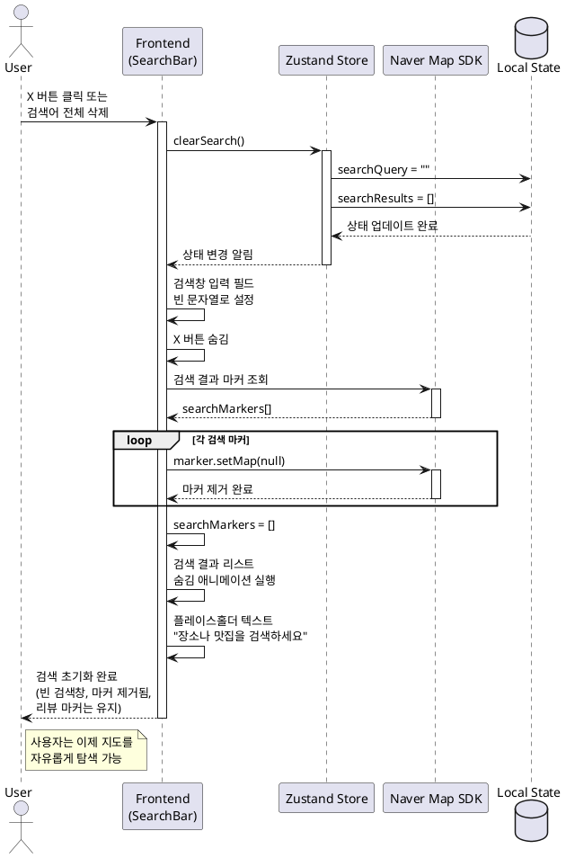

# Usecase: 검색어 초기화 및 지도 재탐색

## 1. Usecase 개요

### 1.1 Usecase ID
`UC-012`

### 1.2 Usecase 이름
검색어 초기화 및 지도 재탐색

### 1.3 목적
사용자가 검색 결과를 초기화하고 새로운 영역을 자유롭게 탐색할 수 있도록 하여, 검색 중심이 아닌 지도 중심의 탐색 경험을 제공한다.

### 1.4 범위
- 검색어 초기화 (검색창 X 버튼 또는 검색어 전체 삭제)
- 검색 결과 마커 제거
- 검색 결과 리스트 숨김 처리
- 지도 자유 탐색 모드로 전환
- 리뷰 존재 장소 마커는 유지

### 1.5 우선순위
P0 (필수)

---

## 2. Actors (행위자)

### 2.1 Primary Actor
- **사용자**: 검색 결과를 초기화하고 지도를 자유롭게 탐색하고자 하는 일반 사용자

### 2.2 Secondary Actor
- **프론트엔드 시스템**: 검색 상태 관리 및 UI 업데이트
- **지도 SDK**: 네이버 지도 마커 제거 및 뷰포트 관리

---

## 3. Preconditions (선행 조건)

### 3.1 필수 선행 조건
- 사용자가 검색을 수행한 상태여야 함
- 검색 결과 마커가 지도에 표시되어 있어야 함
- 검색 결과 리스트가 화면에 표시되어 있어야 함

### 3.2 선택 선행 조건
- 지도가 정상적으로 렌더링되어 있어야 함
- 네이버 지도 SDK가 로드되어 있어야 함

---

## 4. Postconditions (후행 조건)

### 4.1 성공 시나리오 후행 조건
- 검색창이 빈 상태로 초기화됨
- 검색 결과 마커가 지도에서 모두 제거됨
- 검색 결과 리스트가 숨겨지거나 제거됨
- 리뷰가 있는 장소 마커는 지도에 계속 표시됨
- 사용자는 지도를 자유롭게 드래그/줌 가능한 상태

### 4.2 실패 시나리오 후행 조건
- 검색 상태가 유지됨
- 사용자에게 에러 메시지 표시 (필요 시)

---

## 5. Main Success Scenario (주요 성공 시나리오)

### 5.1 Basic Flow

| 단계 | 행위자 | 시스템 동작 |
|------|--------|-------------|
| 1 | 사용자 | 검색창의 X 버튼을 클릭하거나 검색어를 전체 삭제한다 |
| 2 | 시스템 | 검색어 초기화 이벤트를 감지한다 |
| 3 | 시스템 | 검색창 입력 필드를 빈 문자열로 초기화한다 |
| 4 | 시스템 | 검색 상태를 클라이언트 스토어에서 초기화한다 |
| 5 | 시스템 | 지도에서 검색 결과 마커 목록을 조회한다 |
| 6 | 시스템 | 각 검색 결과 마커를 지도에서 제거한다 |
| 7 | 시스템 | 검색 결과 리스트 UI를 숨김 처리 또는 제거한다 |
| 8 | 시스템 | 리뷰 존재 장소 마커는 그대로 유지한다 |
| 9 | 시스템 | X 버튼을 숨기고 검색창을 기본 상태로 복원한다 |
| 10 | 사용자 | 지도를 드래그하거나 줌하여 새로운 영역을 탐색한다 |

### 5.2 데이터 흐름

```
[사용자 입력] → [검색어 초기화 이벤트]
    ↓
[클라이언트 스토어] (검색 상태 초기화)
    ↓
[지도 SDK] → [검색 결과 마커 제거]
    ↓
[UI 업데이트] → [검색 결과 리스트 숨김]
    ↓
[지도 탐색 가능 상태]
```

---

## 6. Alternative Flows (대안 흐름)

### 6.1 Alternative Flow A: 검색창 외부 클릭으로 초기화

| 단계 | 행위자 | 시스템 동작 |
|------|--------|-------------|
| 1a | 사용자 | 검색창이 포커스된 상태에서 지도를 클릭한다 |
| 1b | 시스템 | 검색창에서 포커스를 제거한다 |
| 1c | 시스템 | 검색 결과는 유지한 채 검색창만 닫힌다 |
| - | - | 검색 결과는 유지되며, Main Flow 적용 안 됨 |

### 6.2 Alternative Flow B: 새로운 검색 수행 시 이전 결과 자동 초기화

| 단계 | 행위자 | 시스템 동작 |
|------|--------|-------------|
| 10a | 사용자 | 검색창에 새로운 검색어를 입력하고 검색한다 |
| 10b | 시스템 | 이전 검색 결과 마커를 제거한다 |
| 10c | 시스템 | 새로운 검색 결과를 표시한다 |
| 10d | 시스템 | 검색 결과 리스트를 새 결과로 업데이트한다 |
| - | - | UC-002 (장소/맛집 검색)로 이동 |

### 6.3 Alternative Flow C: 브라우저 뒤로가기로 초기화

| 단계 | 행위자 | 시스템 동작 |
|------|--------|-------------|
| 1a | 사용자 | 브라우저 뒤로가기 버튼을 클릭한다 |
| 1b | 시스템 | URL 쿼리 파라미터에서 search 값을 제거한다 |
| 1c | 시스템 | 검색 상태 초기화 로직을 실행한다 |
| - | - | Main Flow 3단계로 복귀 |

---

## 7. Exception Flows (예외 흐름)

### 7.1 Exception Flow A: 마커 제거 중 오류 발생

| 단계 | 행위자 | 시스템 동작 |
|------|--------|-------------|
| 6a | 시스템 | 마커 제거 중 지도 SDK 오류가 발생한다 |
| 6b | 시스템 | 에러를 콘솔에 로깅한다 |
| 6c | 시스템 | 모든 마커를 강제로 제거하기 위해 지도를 재초기화한다 |
| 6d | 시스템 | 리뷰 존재 장소 마커만 다시 렌더링한다 |
| - | - | Main Flow 7단계로 복귀 |

### 7.2 Exception Flow B: 검색 상태 초기화 실패

| 단계 | 행위자 | 시스템 동작 |
|------|--------|-------------|
| 4a | 시스템 | 클라이언트 스토어 업데이트 중 오류가 발생한다 |
| 4b | 시스템 | 에러를 로깅한다 |
| 4c | 시스템 | 페이지 새로고침을 권장하는 메시지를 표시한다 |
| 4d | 사용자 | 페이지를 새로고침한다 |
| - | - | Usecase 종료 |

---

## 8. Business Rules (비즈니스 규칙)

### 8.1 검색어 초기화 규칙
- **BR-001**: 검색어 X 버튼은 검색어가 1자 이상 입력된 경우에만 표시된다
- **BR-002**: 검색어를 전체 삭제하면 X 버튼이 자동으로 숨겨진다
- **BR-003**: 검색어가 빈 문자열이 되면 자동으로 검색 결과 초기화가 트리거된다

### 8.2 마커 관리 규칙
- **BR-004**: 검색 결과 마커만 제거되며, 리뷰 존재 장소 마커는 유지된다
- **BR-005**: 마커는 지도 SDK의 `setMap(null)` 메서드로 제거된다
- **BR-006**: 마커 배열은 초기화 후 빈 배열로 설정된다

### 8.3 UI 상태 규칙
- **BR-007**: 검색 결과 리스트는 애니메이션과 함께 숨겨진다 (fade-out 또는 slide-down)
- **BR-008**: 검색창은 플레이스홀더 텍스트를 다시 표시한다: "장소나 맛집을 검색하세요"
- **BR-009**: 검색창은 포커스를 잃고 기본 상태로 돌아간다

### 8.4 지도 상태 규칙
- **BR-010**: 지도 중심점과 줌 레벨은 유지된다 (초기화하지 않음)
- **BR-011**: 사용자가 마지막으로 본 지도 영역을 그대로 유지한다
- **BR-012**: 지도 인터랙션(드래그, 줌)은 계속 활성화되어 있다

---

## 9. Special Requirements (특수 요구사항)

### 9.1 성능 요구사항
- **SR-001**: 검색어 초기화 후 마커 제거 완료까지 200ms 이내
- **SR-002**: 검색 결과 리스트 숨김 애니메이션은 300ms 이내
- **SR-003**: 전체 초기화 프로세스는 500ms 이내 완료

### 9.2 사용성 요구사항
- **SR-004**: X 버튼은 충분히 큰 클릭 영역을 제공해야 함 (최소 24x24px)
- **SR-005**: 검색어 삭제 시 시각적 피드백 제공 (버튼 호버, 클릭 효과)
- **SR-006**: 리스트 숨김 시 부드러운 애니메이션 적용

### 9.3 접근성 요구사항
- **SR-007**: X 버튼은 키보드로 접근 가능해야 함 (Tab 키)
- **SR-008**: X 버튼은 적절한 `aria-label` 속성을 가져야 함 ("검색어 지우기")
- **SR-009**: 스크린 리더는 검색 초기화 완료 시 안내 메시지를 읽어야 함

### 9.4 호환성 요구사항
- **SR-010**: Chrome, Safari, Firefox, Edge 최신 2개 버전 지원
- **SR-011**: 모바일 터치 이벤트 정상 작동
- **SR-012**: 화면 크기 375px 이상에서 정상 동작

---

## 10. Frequency of Use (사용 빈도)
- **예상 빈도**: 사용자당 세션당 평균 1-3회
- **사용 시나리오**: 검색 후 다른 영역 탐색, 잘못된 검색어 입력 후 수정

---

## 11. User Interface Requirements (UI 요구사항)

### 11.1 검색창 UI
- **X 버튼 위치**: 검색창 우측, 검색 버튼 좌측
- **X 버튼 크기**: 24x24px (모바일: 32x32px)
- **X 버튼 아이콘**: Lucide X 아이콘 또는 ✕ 유니코드
- **X 버튼 색상**: 회색(#999999), 호버 시 검정(#333333)
- **표시 조건**: 검색어가 1자 이상일 때만 표시
- **애니메이션**: Fade-in/out (0.2초)

### 11.2 검색 결과 리스트 UI
- **숨김 애니메이션**:
  - 모바일: 하단으로 슬라이드 아웃 (300ms)
  - 데스크톱: 좌측으로 슬라이드 아웃 또는 Fade-out (300ms)
- **숨김 후 상태**: `display: none` 또는 DOM에서 제거

### 11.3 지도 UI
- **마커 제거 효과**: 즉시 제거 (애니메이션 없음)
- **리뷰 마커 유지**: 계속 표시됨
- **지도 상태**: 현재 중심점 및 줌 레벨 유지

---

## 12. Data Requirements (데이터 요구사항)

### 12.1 입력 데이터

#### Clear Search Event
```typescript
interface ClearSearchEvent {
  trigger: 'button' | 'delete' | 'backspace' | 'browser_back';
  timestamp: Date;
}
```

### 12.2 출력 데이터

#### Search State (초기화 후)
```typescript
interface SearchState {
  query: string;              // "" (빈 문자열)
  results: PlaceItem[];       // [] (빈 배열)
  isSearching: boolean;       // false
  hasResults: boolean;        // false
}
```

### 12.3 클라이언트 상태 관리

#### Zustand Store State
```typescript
interface MapStore {
  searchQuery: string;
  searchResults: PlaceItem[];
  searchMarkers: naver.maps.Marker[];
  reviewMarkers: naver.maps.Marker[];

  // Actions
  clearSearch: () => void;
  setSearchQuery: (query: string) => void;
}
```

---

## 13. Technical Constraints (기술적 제약사항)

### 13.1 지도 SDK 제약
- **TC-001**: 네이버 지도 SDK의 마커는 `setMap(null)`로만 제거 가능
- **TC-002**: 마커 배열은 수동으로 관리 필요 (SDK에서 자동 관리 안 함)
- **TC-003**: 마커 제거는 동기적으로 처리됨

### 13.2 상태 관리 제약
- **TC-004**: Zustand 스토어는 React 컴포넌트 외부에서도 접근 가능
- **TC-005**: URL 쿼리 파라미터와 클라이언트 상태 동기화 필요
- **TC-006**: 브라우저 히스토리 관리 필요 (뒤로가기 대응)

### 13.3 성능 제약
- **TC-007**: 마커가 50개 이상일 경우 제거 시간 증가 가능
- **TC-008**: 리스트 DOM 제거 시 메모리 해제 확인 필요

---

## 14. Assumptions (가정사항)

### 14.1 사용자 환경 가정
- **AS-001**: 사용자는 검색 기능을 이미 사용한 상태이다
- **AS-002**: 사용자는 검색 결과를 확인한 후 초기화를 원한다
- **AS-003**: 사용자는 지도 탐색 방법을 알고 있다

### 14.2 시스템 가정
- **AS-004**: 지도 SDK는 정상적으로 로드되어 있다
- **AS-005**: 클라이언트 상태 관리 시스템은 정상 작동한다
- **AS-006**: 네이버 지도 마커 API는 정상 작동한다

### 14.3 데이터 가정
- **AS-007**: 검색 결과 마커와 리뷰 마커는 명확히 구분되어 있다
- **AS-008**: 마커 배열은 메모리에 유지되어 있다
- **AS-009**: 검색 상태는 클라이언트에서만 관리된다 (서버 상태 없음)

---

## 15. Dependencies (의존성)

### 15.1 외부 의존성
- **DEP-001**: 네이버 지도 JavaScript SDK v3 (마커 제거 API)
- **DEP-002**: 브라우저 History API (뒤로가기 처리)

### 15.2 내부 의존성
- **DEP-003**: UC-002 (장소/맛집 검색) 완료 상태
- **DEP-004**: Zustand 전역 상태 관리
- **DEP-005**: 검색 컴포넌트 (`src/features/search/components/SearchBar.tsx`)
- **DEP-006**: 지도 마커 관리 유틸 (`src/features/map/lib/markerManager.ts`)

---

## 16. Testing Scenarios (테스트 시나리오)

### 16.1 기능 테스트

#### TC-F-001: X 버튼으로 초기화
- **Given**: 검색 결과가 표시된 상태
- **When**: 검색창의 X 버튼 클릭
- **Then**:
  - 검색창이 빈 상태로 초기화됨
  - 검색 결과 마커가 모두 제거됨
  - 검색 결과 리스트가 숨겨짐
  - 리뷰 마커는 그대로 유지됨

#### TC-F-002: 검색어 전체 삭제로 초기화
- **Given**: 검색어가 입력된 상태
- **When**: 백스페이스로 검색어를 전부 삭제
- **Then**:
  - X 버튼이 자동으로 숨겨짐
  - 검색 결과가 자동으로 초기화됨
  - 검색창이 기본 상태로 복원됨

#### TC-F-003: 브라우저 뒤로가기로 초기화
- **Given**: 검색 결과 페이지 (`/?search=강남역`)
- **When**: 브라우저 뒤로가기 버튼 클릭
- **Then**:
  - URL이 `/`로 변경됨
  - 검색 상태가 초기화됨
  - 검색 결과가 제거됨

#### TC-F-004: 새로운 검색으로 이전 결과 초기화
- **Given**: 검색어 "홍대" 결과가 표시된 상태
- **When**: 검색어를 "강남역"으로 변경하고 검색
- **Then**:
  - 이전 검색 마커(홍대)가 제거됨
  - 새 검색 마커(강남역)가 표시됨

#### TC-F-005: 리뷰 마커 유지 확인
- **Given**: 검색 결과 마커 5개, 리뷰 마커 3개가 표시된 상태
- **When**: 검색 초기화
- **Then**:
  - 검색 결과 마커 5개만 제거됨
  - 리뷰 마커 3개는 그대로 유지됨

### 16.2 예외 처리 테스트

#### TC-E-001: 마커 제거 실패
- **Given**: 지도 SDK 오류 상태
- **When**: 검색 초기화 시도
- **Then**:
  - 에러 로깅됨
  - 지도 재초기화 시도
  - 리뷰 마커만 다시 렌더링

#### TC-E-002: 빈 검색 상태에서 초기화
- **Given**: 검색을 수행하지 않은 상태
- **When**: X 버튼 클릭 (표시되지 않음)
- **Then**: 아무 동작도 수행되지 않음

#### TC-E-003: 동시 다중 초기화 요청
- **Given**: 검색 결과가 표시된 상태
- **When**: X 버튼을 빠르게 여러 번 클릭
- **Then**:
  - 첫 번째 요청만 처리됨
  - 중복 처리 방지됨

### 16.3 성능 테스트

#### TC-P-001: 대량 마커 제거
- **Given**: 검색 결과 마커 50개가 표시된 상태
- **When**: 검색 초기화
- **Then**:
  - 200ms 이내 모든 마커 제거됨
  - 전체 프로세스 500ms 이내 완료

#### TC-P-002: 메모리 누수 확인
- **Given**: 검색 초기화를 10회 반복
- **When**: 브라우저 메모리 사용량 측정
- **Then**:
  - 메모리 사용량이 계속 증가하지 않음
  - 마커 객체가 정상적으로 가비지 컬렉션됨

### 16.4 UI/UX 테스트

#### TC-U-001: X 버튼 표시/숨김
- **Given**: 검색창이 비어있음
- **When**: 문자 1개 입력
- **Then**:
  - X 버튼이 Fade-in 애니메이션과 함께 나타남
  - 버튼 크기가 적절함 (24x24px)

#### TC-U-002: 키보드 접근성
- **Given**: 검색어가 입력된 상태
- **When**: Tab 키로 X 버튼 포커스 후 Enter
- **Then**:
  - 검색이 정상적으로 초기화됨
  - 포커스 인디케이터가 명확함

#### TC-U-003: 모바일 터치
- **Given**: 모바일 기기에서 검색 결과 표시
- **When**: X 버튼 터치
- **Then**:
  - 터치 이벤트가 정상 작동함
  - 버튼 크기가 충분함 (32x32px)

---

## 17. Open Issues (미해결 이슈)

### 17.1 UX 이슈
- **ISSUE-001**: 검색 초기화 시 지도 중심점을 사용자 현재 위치로 복원할지 결정 필요
- **ISSUE-002**: 검색 결과 리스트 숨김 시 애니메이션 방향 (좌측 vs 하단) 결정 필요
- **ISSUE-003**: X 버튼 대신 "초기화" 텍스트 버튼 사용 여부 검토 필요

### 17.2 기술적 이슈
- **ISSUE-004**: URL 쿼리 파라미터 관리 방식 결정 (pushState vs replaceState)
- **ISSUE-005**: 검색 히스토리 기능 추가 시 초기화 동작 재검토 필요

---

## 18. Notes (참고사항)

### 18.1 구현 참고사항
- 검색 초기화 기능은 `@/features/search` 디렉토리에 구현
- 마커 관리는 `@/features/map/lib/markerManager.ts` 유틸 사용
- 상태 관리는 Zustand 스토어 사용 (`@/features/map/store/useMapStore.ts`)
- URL 동기화는 Next.js Router 사용

### 18.2 관련 문서
- [PRD 문서](/docs/prd.md)
- [User Flow 문서](/docs/userflow.md) - 섹션 12
- [UC-002: 장소/맛집 검색](/docs/usecases/2-place-search/spec.md)

### 18.3 변경 이력

| 버전 | 날짜 | 작성자 | 변경 내용 |
|------|------|--------|-----------|
| 1.0 | 2025-10-22 | Senior Developer | 초안 작성 |

---

## 19. Acceptance Criteria (수락 기준)

### 19.1 필수 기준
- [ ] X 버튼 클릭 시 검색어가 빈 상태로 초기화됨
- [ ] 검색 결과 마커가 모두 지도에서 제거됨
- [ ] 검색 결과 리스트가 숨겨짐
- [ ] 리뷰 존재 장소 마커는 유지됨
- [ ] 지도 중심점과 줌 레벨은 유지됨
- [ ] 검색창이 기본 플레이스홀더를 표시함
- [ ] X 버튼이 검색어 입력 시에만 표시됨
- [ ] 브라우저 뒤로가기 시 검색 상태 초기화됨
- [ ] 모바일 터치 이벤트 정상 작동
- [ ] 키보드 접근성 지원

### 19.2 성능 기준
- [ ] 마커 제거 완료 시간 200ms 이내
- [ ] 리스트 숨김 애니메이션 300ms 이내
- [ ] 전체 초기화 프로세스 500ms 이내

### 19.3 접근성 기준
- [ ] X 버튼 키보드 접근 가능
- [ ] X 버튼 aria-label 적용
- [ ] 스크린 리더 안내 메시지 제공

---

## 20. Sequence Diagram



---

**문서 승인**
- Product Owner: [ ]
- Engineering Lead: [ ]
- QA Lead: [ ]

---

이 문서는 ConnectMap 프로젝트의 "검색어 초기화 및 지도 재탐색" 기능에 대한 공식 Usecase Specification입니다.
모든 개발, 테스트, QA 작업은 본 문서를 기준으로 진행됩니다.
