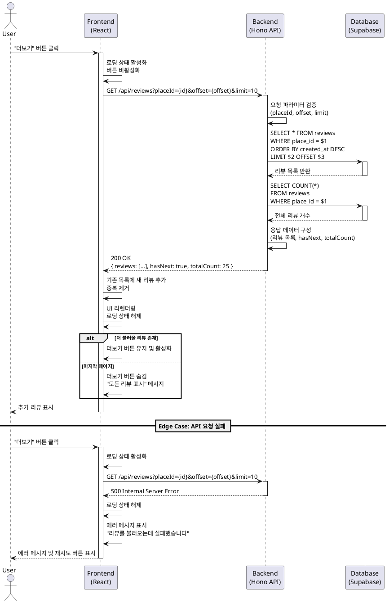

# Usecase 5: 전체 리뷰 펼치기

## Primary Actor
맛집 탐색자 (Explorer) - 장소의 모든 리뷰를 확인하고자 하는 사용자

## Precondition
- 사용자가 장소 상세 페이지에 진입한 상태
- 해당 장소에 3개 이상의 리뷰가 존재
- 초기 리뷰 목록에는 일부 리뷰(3-5개)만 표시된 상태
- 추가로 불러올 리뷰가 존재하여 "전체 리뷰 보기" 또는 "더보기" 버튼이 표시됨

## Trigger
- 사용자가 "전체 리뷰 보기" 또는 "더보기" 버튼을 클릭
- 또는 리뷰 목록을 스크롤하여 리스트 하단에 도달

## Main Scenario

1. 사용자가 장소 상세 페이지에서 초기 리뷰 목록(3-5개)을 확인
2. 사용자가 "전체 리뷰 보기" 또는 "더보기" 버튼 클릭
3. 프론트엔드가 다음 페이지 리뷰 데이터를 요청
   - 현재 오프셋 또는 커서 정보를 포함한 GET 요청 전송
   - 로딩 인디케이터 표시
4. 백엔드가 요청을 수신하고 유효성 검증
   - placeId 확인
   - 오프셋/커서 유효성 확인
5. 데이터베이스에서 다음 페이지 리뷰 조회
   - 페이지네이션 파라미터에 따라 다음 N개 리뷰 조회
   - 작성일 기준 최신순 정렬
6. 백엔드가 리뷰 데이터 응답
   - 리뷰 목록
   - 다음 페이지 존재 여부
   - 전체 리뷰 개수
7. 프론트엔드가 기존 리뷰 목록에 새 데이터 추가
   - 중복 제거 처리
   - UI 리렌더링
8. 추가된 리뷰들이 리스트 하단에 표시됨
9. 더 불러올 리뷰가 있는 경우 버튼 유지, 없는 경우 버튼 숨김 또는 "마지막 리뷰입니다" 메시지 표시

## Edge Cases

### EC-1: 더 이상 리뷰가 없음
- **상황**: 모든 리뷰를 이미 불러온 상태에서 더보기 시도
- **처리**:
  - 버튼 비활성화 또는 숨김
  - "모든 리뷰를 불러왔습니다" 또는 "마지막 리뷰입니다" 메시지 표시
  - 추가 API 요청 방지

### EC-2: API 요청 실패
- **상황**: 네트워크 오류 또는 서버 에러로 리뷰 로딩 실패
- **처리**:
  - 로딩 인디케이터 제거
  - 에러 메시지 표시 ("리뷰를 불러오는데 실패했습니다")
  - 재시도 버튼 제공
  - 기존 리뷰 목록은 유지

### EC-3: 중복 데이터 로드
- **상황**: 동시 요청이나 잘못된 오프셋으로 중복 리뷰 수신
- **처리**:
  - 클라이언트 측에서 리뷰 ID 기반 중복 제거
  - 중복 제거 후 실제 새 리뷰가 없으면 다음 페이지 재요청

### EC-4: 빈 응답
- **상황**: API는 성공했으나 리뷰 배열이 비어있음
- **처리**:
  - "추가 리뷰가 없습니다" 메시지 표시
  - 더보기 버튼 숨김

### EC-5: 중복 클릭 방지
- **상황**: 사용자가 더보기 버튼을 빠르게 여러 번 클릭
- **처리**:
  - 로딩 중 버튼 비활성화
  - 첫 번째 요청이 완료될 때까지 추가 요청 차단
  - 디바운싱 적용

### EC-6: 페이지 크기 초과
- **상황**: 요청한 페이지 크기가 서버 제한을 초과
- **처리**:
  - 백엔드에서 최대 페이지 크기 제한 적용 (예: 20개)
  - 클라이언트는 서버 설정을 따름

## Business Rules

### BR-1: 페이지네이션 전략
- 초기 로드: 3-5개 리뷰
- 추가 로드: 페이지당 10개 리뷰
- 최대 한번에 불러올 수 있는 리뷰 수: 20개

### BR-2: 리뷰 정렬 순서
- 기본 정렬: 작성일 기준 최신순 (created_at DESC)
- 향후 확장: 평점순, 도움됨순 등 추가 가능

### BR-3: 성능 최적화
- 무한 스크롤 또는 페이지네이션 방식 선택 가능
- 커서 기반 페이지네이션 사용 시 안정적인 정렬 보장
- 오프셋 기반 사용 시 성능 고려 (대량 데이터의 경우 커서 기반 권장)

### BR-4: 데이터 일관성
- 리뷰 로딩 중 새 리뷰가 작성되어도 현재 페이지네이션 상태에 영향 없음
- 페이지 새로고침 시 최신 데이터 반영

### BR-5: 캐싱 전략
- React Query 등을 활용한 클라이언트 측 캐싱
- 동일 장소 재방문 시 캐시된 리뷰 즉시 표시
- staleTime 설정으로 적절한 캐시 무효화

## Sequence Diagram



## API Specification

### Request
```
GET /api/reviews?placeId={uuid}&offset={number}&limit={number}
```

**Query Parameters:**
- `placeId` (required): 장소 UUID
- `offset` (optional, default: 0): 건너뛸 리뷰 개수
- `limit` (optional, default: 10, max: 20): 가져올 리뷰 개수

### Response (Success)
```json
{
  "success": true,
  "data": {
    "reviews": [
      {
        "id": "uuid",
        "authorName": "string",
        "rating": 1-5,
        "content": "string",
        "createdAt": "ISO 8601 timestamp"
      }
    ],
    "pagination": {
      "offset": 5,
      "limit": 10,
      "totalCount": 25,
      "hasNext": true
    }
  }
}
```

### Response (Error)
```json
{
  "success": false,
  "error": {
    "code": "INVALID_PLACE_ID",
    "message": "유효하지 않은 장소 ID입니다"
  }
}
```
