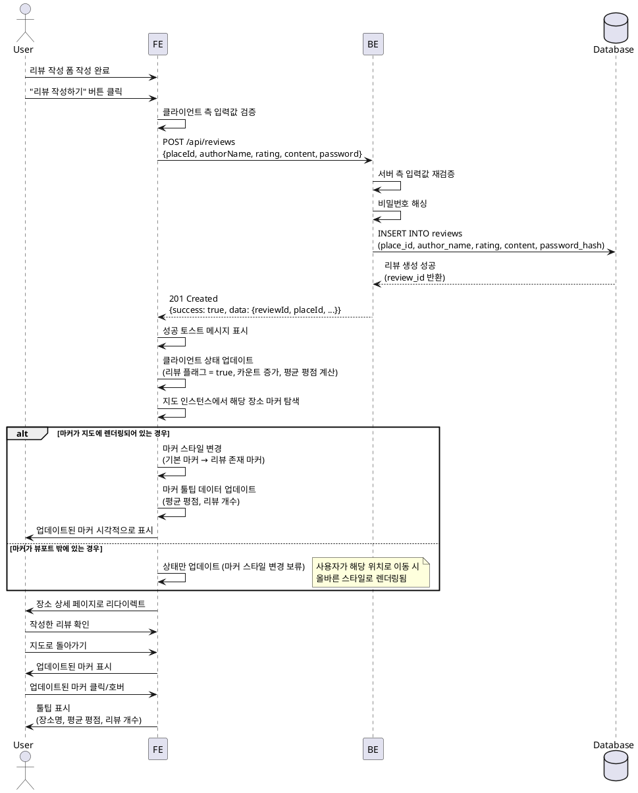

# UseCase 8: 리뷰 작성 후 지도 마커 업데이트

## Primary Actor
- 리뷰 작성자 (Contributor)

## Precondition
- 사용자가 리뷰 작성을 완료하고 제출에 성공함
- 지도 화면이 현재 브라우저에 열려있거나 사용자가 지도로 돌아갈 수 있는 상태

## Trigger
- 리뷰 생성 API 응답이 성공 상태(201 Created)로 반환됨

## Main Scenario

1. 사용자가 리뷰 작성 폼을 모두 작성하고 "리뷰 작성하기" 버튼을 클릭
2. FE가 입력값을 검증하고 BE로 리뷰 생성 요청 전송
3. BE가 리뷰 데이터를 검증하고 DB에 저장
4. DB가 새로운 리뷰 레코드를 생성하고 성공 응답 반환
5. BE가 FE에게 리뷰 생성 성공 응답 반환 (리뷰 ID, 장소 ID 포함)
6. FE가 성공 토스트 메시지 표시
7. FE가 클라이언트 측 상태 업데이트:
   - 해당 장소의 리뷰 존재 플래그를 true로 설정
   - 리뷰 카운트 증가
   - 평균 평점 재계산
8. FE가 지도 인스턴스에서 해당 장소의 마커를 탐색
9. FE가 마커 스타일을 변경:
   - 기본 마커 아이콘 → 리뷰 존재 마커 아이콘 (색상/아이콘 변경)
   - 마커 툴팁 데이터 업데이트 (평균 평점, 리뷰 개수 추가)
10. 사용자가 장소 상세 페이지로 자동 리다이렉트됨
11. 사용자가 작성한 리뷰를 리뷰 목록 최상단에서 확인
12. 사용자가 지도로 돌아가면 업데이트된 마커를 시각적으로 확인

## Edge Cases

### EC-1: 마커가 지도에 렌더링되지 않은 경우
- **상황**: 사용자가 리뷰를 작성한 장소가 현재 지도 뷰포트 밖에 있어 마커가 렌더링되지 않음
- **처리**:
  - 클라이언트 측 상태만 업데이트
  - 사용자가 해당 위치로 지도를 이동하면 그때 올바른 마커 스타일로 렌더링

### EC-2: 첫 번째 리뷰가 아닌 경우
- **상황**: 이미 리뷰가 존재하는 장소에 추가 리뷰를 작성
- **처리**:
  - 마커 아이콘은 이미 리뷰 존재 상태이므로 스타일 변경 없음
  - 마커 툴팁 데이터만 업데이트 (평균 평점, 리뷰 개수)

### EC-3: 네트워크 지연으로 응답이 늦게 도착
- **상황**: 리뷰 생성 요청 후 응답이 지연됨
- **처리**:
  - 로딩 인디케이터 표시
  - 타임아웃 설정 (30초)
  - 타임아웃 시 에러 메시지 표시 및 재시도 옵션 제공

### EC-4: 리뷰 생성 성공 후 페이지 이동 전 새로고침
- **상황**: 사용자가 리뷰 작성 완료 후 페이지 이동 전에 브라우저 새로고침
- **처리**:
  - 서버에는 이미 리뷰가 저장된 상태
  - 새로고침 시 지도 초기화 과정에서 DB로부터 최신 데이터 조회
  - 마커가 올바른 리뷰 존재 상태로 표시됨

### EC-5: 동시에 여러 사용자가 같은 장소에 리뷰 작성
- **상황**: 다수의 사용자가 거의 동시에 같은 장소에 리뷰 작성
- **처리**:
  - 각 사용자의 클라이언트는 독립적으로 마커 업데이트 수행
  - 실시간 동기화 없음 (다른 사용자 작성 리뷰는 페이지 새로고침 시 반영)
  - 평균 평점은 각자의 리뷰 기준으로 표시, 다음 조회 시 서버 데이터 기준으로 동기화

### EC-6: 마커 업데이트 실패 (지도 API 오류)
- **상황**: 네이버 지도 SDK API 호출 중 오류 발생
- **처리**:
  - 에러 로깅 (콘솔 또는 모니터링 서비스)
  - 사용자에게는 성공 메시지 표시 (리뷰 저장은 완료됨)
  - 페이지 새로고침 또는 지도 재초기화 시 정상 반영

## Business Rules

### BR-1: 마커 스타일 차별화
- 리뷰가 없는 장소: 회색 기본 마커
- 리뷰가 1개 이상인 장소: 빨간색 또는 특별 아이콘 마커
- 마커 변경은 클라이언트 측에서 즉시 반영되어야 함

### BR-2: 툴팁 정보 업데이트
- 마커 툴팁에 표시되는 정보:
  - 장소명
  - 평균 평점 (별 그래픽, 소수점 1자리)
  - 총 리뷰 개수
  - 최근 리뷰 미리보기 (옵션)
- 리뷰 작성 시 툴팁 데이터가 자동으로 갱신되어야 함

### BR-3: 상태 동기화
- 리뷰 작성 성공 시 다음 상태들이 동기화되어야 함:
  - 클라이언트 측 장소 상태 (리뷰 플래그, 카운트, 평균 평점)
  - 지도 마커 스타일
  - 마커 툴팁 데이터
- 동기화 실패 시에도 리뷰 데이터는 DB에 보존됨

### BR-4: 사용자 피드백
- 리뷰 작성 완료 시 성공 메시지를 명확히 표시
- 마커 변경 사항을 사용자가 쉽게 인지할 수 있도록 시각적 피드백 제공
- 장소 상세 페이지로 자동 리다이렉트하여 작성한 리뷰 확인 가능

### BR-5: 성능 고려사항
- 마커 업데이트는 DOM 조작을 최소화하여 성능 저하 방지
- 불필요한 리렌더링을 피하기 위해 필요한 마커만 업데이트
- 지도에 표시된 마커 수가 많을 경우 클러스터링 고려 (향후)

## Sequence Diagram

