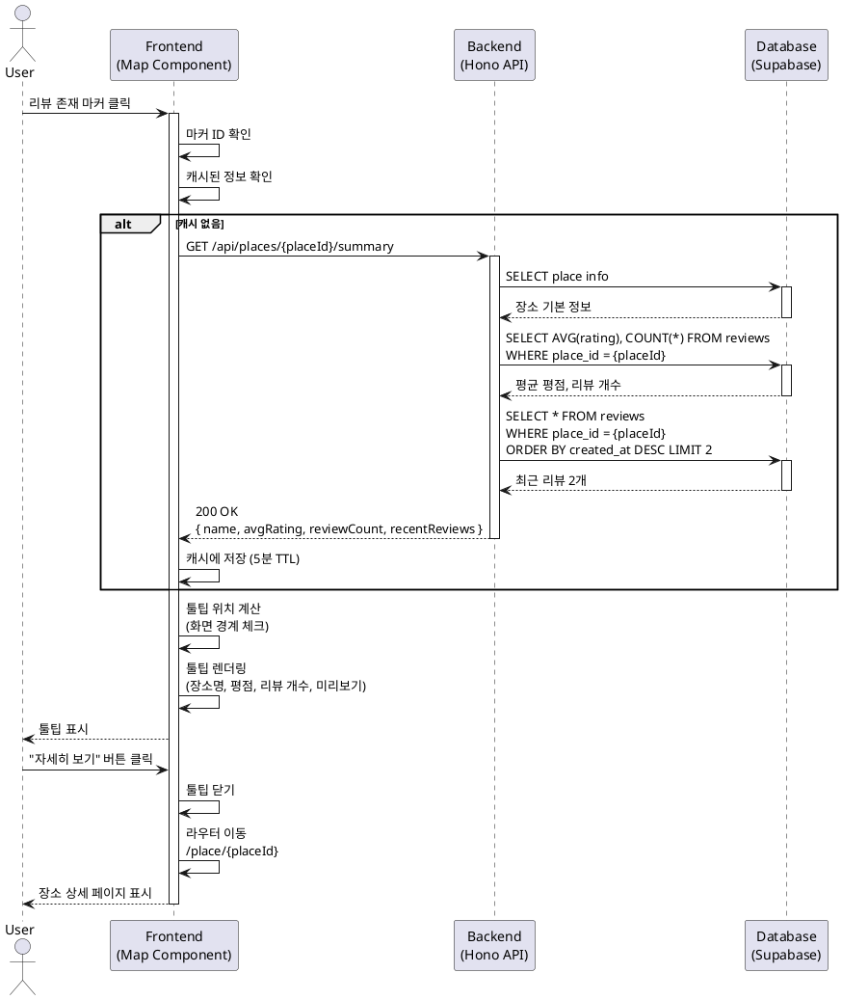

# UC-009: 리뷰 존재 장소 마커 클릭 (툴팁 표시)

## Primary Actor
- 맛집 탐색자 (일반 사용자)

## Precondition
- 사용자가 메인 지도 화면에 접속한 상태
- 지도에 리뷰가 존재하는 장소 마커가 표시되어 있음
- 네이버 지도 SDK가 정상적으로 로드됨

## Trigger
- 사용자가 지도의 리뷰 존재 마커를 클릭
- 또는 마커 위에 마우스 오버 (선택적)

## Main Scenario

### 1. 마커 클릭 감지
사용자가 지도에 표시된 리뷰 존재 마커(특별 아이콘/색상)를 클릭한다.

### 2. 장소 정보 조회
시스템은 클릭된 마커의 장소 ID를 확인하고, 해당 장소의 리뷰 요약 정보를 조회한다:
- 장소 기본 정보 (장소명)
- 평균 평점
- 총 리뷰 개수
- 최근 리뷰 1-2개 미리보기 (선택적)

### 3. 툴팁 위치 계산
시스템은 마커의 화면 좌표를 기준으로 툴팁 표시 위치를 계산한다:
- 기본: 마커 상단에 표시
- 화면 상단 경계 근처: 마커 하단에 표시
- 화면 좌우 경계 근처: 중앙으로 조정

### 4. 툴팁 렌더링
시스템은 계산된 위치에 툴팁을 표시한다:
- 장소명 (Bold, 16px)
- 평균 평점 (별 아이콘 그래픽, 1-5점)
- 총 리뷰 개수 (예: "리뷰 12개")
- 최근 리뷰 미리보기 (선택적)
  - 작성자명
  - 평점
  - 리뷰 내용 일부 (최대 50자)
- "자세히 보기" 버튼

### 5. 사용자 인터랙션 대기
툴팁이 표시된 상태에서 다음 액션을 대기한다:
- "자세히 보기" 버튼 클릭: 장소 상세 페이지로 이동
- 툴팁 외부 영역 클릭: 툴팁 닫기
- ESC 키 입력: 툴팁 닫기
- 다른 마커 클릭: 기존 툴팁 닫고 새 툴팁 표시

### 6. 장소 상세 페이지 이동 (선택)
사용자가 "자세히 보기" 버튼을 클릭하면:
- 툴팁이 닫힘
- 장소 상세 페이지(`/place/{placeId}`)로 이동
- 전체 리뷰 목록 및 상세 정보 표시

## Edge Cases

### 1. 리뷰 정보 로딩 실패
- **상황**: 네트워크 오류 또는 DB 조회 실패
- **처리**: 툴팁에 에러 메시지 표시 ("정보를 불러올 수 없습니다"), 재시도 버튼 제공

### 2. 툴팁 로딩 지연
- **상황**: 리뷰 정보 조회에 시간 소요
- **처리**: 툴팁 영역에 로딩 스피너 표시 (최대 2초 대기)

### 3. 툴팁이 화면 밖으로 벗어남
- **상황**: 마커가 화면 경계 근처에 위치
- **처리**: 툴팁 위치를 자동으로 조정하여 화면 안에 표시

### 4. 리뷰 개수가 0개
- **상황**: 마커는 표시되어 있으나 리뷰가 없음 (데이터 불일치)
- **처리**: 툴팁에 "아직 리뷰가 없습니다" 메시지 표시, "첫 리뷰 작성하기" 버튼 제공

### 5. 모바일 환경
- **상황**: 작은 화면에서 툴팁 표시
- **처리**: 툴팁을 화면 하단에 슬라이드업 패널로 표시 (대체 UI)

### 6. 빠른 연속 클릭
- **상황**: 사용자가 여러 마커를 빠르게 클릭
- **처리**: 이전 툴팁을 즉시 닫고 새 툴팁만 표시, 디바운싱 적용

### 7. 평균 평점이 소수점
- **상황**: 평균 평점이 4.5점 등 소수점 포함
- **처리**: 소수점 첫째 자리까지 표시 (예: 4.5), 별 아이콘은 정수만 표시 (4.5 → 별 4개)

### 8. 장소명이 너무 긺
- **상황**: 장소명이 30자 이상
- **처리**: 툴팁 너비 제한, 긴 텍스트는 말줄임(...) 처리

## Business Rules

### BR-1: 툴팁 표시 조건
- 리뷰가 1개 이상 존재하는 장소의 마커만 툴팁 표시
- 리뷰가 없는 장소는 기본 마커로 표시되며 클릭 시 간단한 정보만 표시

### BR-2: 평균 평점 계산
- 평균 평점 = SUM(rating) / COUNT(reviews)
- 소수점 첫째 자리까지 반올림 (예: 4.67 → 4.7)
- 별 아이콘은 정수 부분만 표시 (4.7 → 별 4개)

### BR-3: 툴팁 자동 닫기 조건
- 툴팁 외부 영역 클릭 시
- ESC 키 입력 시
- 다른 마커 클릭 시
- 지도 드래그/줌 시 (선택적)

### BR-4: 캐싱 정책
- 동일 장소의 툴팁 정보는 클라이언트에 5분간 캐싱
- 리뷰 작성 후에는 해당 장소 캐시 무효화

### BR-5: 최근 리뷰 미리보기 개수
- 최대 2개의 최근 리뷰 표시
- 리뷰 내용은 50자까지만 표시, 초과 시 말줄임 처리

### BR-6: 접근성 지원
- 툴팁은 키보드 포커스 가능
- 스크린 리더에서 장소명, 평점, 리뷰 개수 읽기 지원
- ARIA 속성 적용 (role="tooltip", aria-describedby)

### BR-7: 반응형 지원
- 데스크톱: 마커 상단/하단에 팝업 형태
- 모바일/태블릿: 화면 하단에 슬라이드업 패널 형태

## Sequence Diagram



## API Specification

### Endpoint: GET /api/places/{placeId}/summary

**Request:**
```
GET /api/places/550e8400-e29b-41d4-a716-446655440000/summary
```

**Response (200 OK):**
```json
{
  "success": true,
  "data": {
    "placeId": "550e8400-e29b-41d4-a716-446655440000",
    "name": "강남 소고기집",
    "avgRating": 4.5,
    "reviewCount": 12,
    "recentReviews": [
      {
        "id": "660e8400-e29b-41d4-a716-446655440001",
        "authorName": "맛집러버",
        "rating": 5,
        "content": "고기가 정말 부드럽고 맛있어요. 특히 양념 갈비가 일품...",
        "createdAt": "2025-10-20T15:30:00Z"
      },
      {
        "id": "770e8400-e29b-41d4-a716-446655440002",
        "authorName": "푸디",
        "rating": 4,
        "content": "가격 대비 훌륭합니다. 다만 대기가 좀 있어요.",
        "createdAt": "2025-10-19T12:20:00Z"
      }
    ]
  }
}
```

**Response (404 Not Found):**
```json
{
  "success": false,
  "error": {
    "code": "PLACE_NOT_FOUND",
    "message": "장소를 찾을 수 없습니다."
  }
}
```

**Response (500 Internal Server Error):**
```json
{
  "success": false,
  "error": {
    "code": "INTERNAL_ERROR",
    "message": "정보를 불러오는 중 오류가 발생했습니다."
  }
}
```

## UI/UX Considerations

### 툴팁 디자인
- **배경색**: 화이트 (#FFFFFF)
- **테두리**: 1px solid #DDDDDD
- **그림자**: box-shadow: 0 4px 12px rgba(0,0,0,0.15)
- **둥근 모서리**: border-radius: 8px
- **패딩**: 16px
- **최대 너비**: 320px (데스크톱), 280px (모바일)

### 별 아이콘
- **색상**: 채워진 별 #FFD700 (골드), 빈 별 #E0E0E0 (라이트 그레이)
- **크기**: 16px × 16px

### 애니메이션
- **등장**: fade-in + scale (0.95 → 1.0), 200ms ease-out
- **사라짐**: fade-out, 150ms ease-in

### "자세히 보기" 버튼
- **색상**: 네이버 그린 (#03C75A)
- **텍스트 색상**: 화이트 (#FFFFFF)
- **패딩**: 8px 16px
- **둥근 모서리**: border-radius: 6px
- **호버 효과**: background-color: #02B050

## Related Use Cases
- UC-004: 장소 상세 정보 및 리뷰 조회
- UC-002: 장소/맛집 검색
- UC-008: 리뷰 작성 후 지도 마커 업데이트

## Notes
- 툴팁은 경량화된 정보만 표시하여 로딩 속도 최적화
- 상세 정보는 장소 상세 페이지에서 제공
- 모바일 환경에서는 터치 인터랙션 최적화 필요
- 지도 줌 레벨에 따라 마커 클러스터링 고려 (향후 기능)
